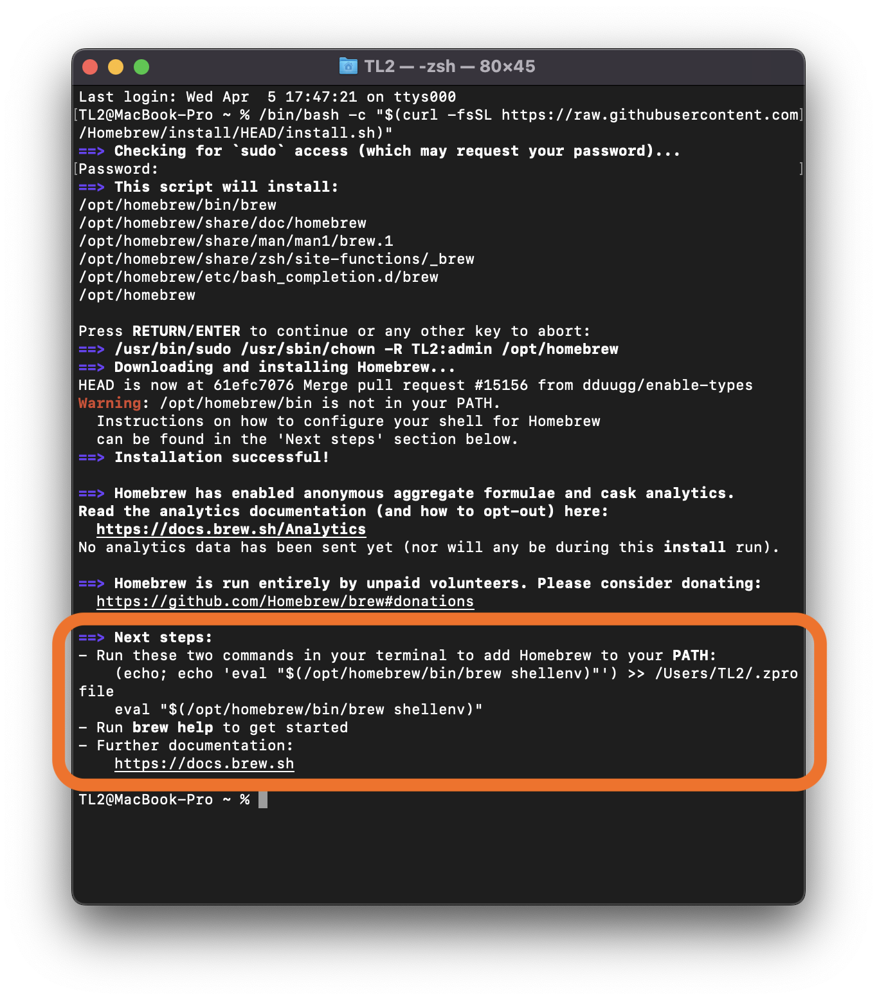

Complete the following steps before your first Mod 0 session in order to get the tools you'll need on your machine. Plan to spend 60-120 minutes on this.

Here's what we'll cover in this guide. Click a link to jump to that portion of the guide:

- [Install Rectangle](#install-rectangle)
- [Install Chrome](#install-chrome)
- [Install Slack](#install-slack)
- [Create a Replit Account](#replit)
- [Create a Loom Account](#create-loom-account)
- [Install Zoom](#install-zoom)
- [Enable Screen Sharing](#enable-screen-sharing)
- [Install Xcode-select](#install-xcode-select)
- [Install and Configure VS Code](#install-and-configure-vs-code)
- [Install Homebrew](#install-homebrew)
- [Install Git](#install-git)
- [Configure GitHub](#configure-github)
- [Install rbenv](#install-rbenv)
- [Install Node](#install-node)


<br>

### Install Rectangle

Rectangle is a screen management application that allows you to move and resize windows to maximize your screen space as well as your time.

Once you've installed Rectangle, open the application and it will run in the background. You should see a smaller version of the Rectangle icon in the top right corner of your screen.

**Action Steps:**
- [Download and install Rectangle](https://rectangleapp.com/).
- Take some time to play around with the commands to adjust the position and size of different windows on your screen using the Rectangle keyboard shortcuts.

<br>

### Install Chrome

Chrome includes a set of Developer Tools that will come in handy down the road. Additionally, it is always on the cutting edge of supporting new web technologies.

**Action Steps:**
- _If you haven't already,_ [download and install Chrome](https://www.google.com/chrome/).
- Set Chrome as your default browser: 
  - In your Chrome window, select the More menu by clicking on the three dots.
  - Select `Settings` from the list.
  - In the Default browser section on the left, click `Make default`.

<br>

### Install Slack

Slack is our main communication tool at Turing. **You will receive an invitation to join the Turing Workspace 2 weeks before your Mod 0 start date**. If you are not familiar with it, it may seem overwhelming at first. There are a lot of tips and tricks you'll pick up along the way.

**Action Steps:**
- [Download and install the Slack desktop application](https://slack.com/downloads/mac)

To ensure that you are prepared for your first session:
- Watch the [Slack Tutorial Video](https://www.youtube.com/watch?v=tfq333EpWgM).
- Read [Slack 101](https://frontend.turing.edu/lessons/module-1/slack101.html) to understand how to take advantage of the most useful features in Slack.
- Upload a clear and appropriate headshot for your profile image.
- [Set up your Slack profile](https://www.loom.com/share/6f10b796c90f40c09594899d71bf401a) to include your cohort, program, pronouns, and time zone.
- It's a good idea to get in the habit of checking Slack daily starting now.
<br>

### Create a Replit Account

[Replit](https://replit.com/~) provides an online platform that allows us to write code and see the results almost immediately - all inside of one browser tab! There are many other similar (and awesome) tools available but replit is used regularly in Mods 1 and 2, so Mod 0 provides an introduction and some exposure.

Follow the steps below (if they are not necessary because you have already done them or have experience with replit, you can skip this):
- Create a free account.
- [Bookmark this webpage on Chrome](https://support.google.com/chrome/answer/188842?hl=en&co=GENIE.Platform%3DDesktop), so that you can easily find it again later.
- [Watch this video](https://www.youtube.com/watch?v=cnLE3bH6fHE) to learn how to navigate the interface and create new projects.

<br>

### Create a Loom Account

[Loom](https://www.loom.com/) is a free online video tool that allows you to create instantly shareable videos. With Loom, you can record your camera, microphone, and desktop simultaneously. You will be required to submit videos throughout Mod 0 as part of the coursework. Although you can use other tools to accomplish the same goal, we strongly recommend using Loom as it is extremely user-friendly.

- Please create a free account with Loom.
- [Bookmark this webpage on Chrome](https://support.google.com/chrome/answer/188842?hl=en&co=GENIE.Platform%3DDesktop), so that you can easily find it again later.
- If you've never used Loom before, [watch this video](https://youtu.be/iugmJe8uDLE) to familiarize yourself with this tool.

<br>

### Install Zoom

Zoom is the primary tool for classroom time, study halls, and community building at Turing.

**Action Steps:**
- [Download and install Zoom](https://zoom.us/download/) for _Macs with Apple Silicon chips_
- If you haven't already, create an account with Zoom.
- [Update your name in your profile](https://support.zoom.us/hc/en-us/articles/201363203-My-Profile) following this pattern: First Name, Last Initial, pronouns, Program - `Kaitlyn V (she/her), FE`.
- [Learn how to raise your hand](https://support.zoom.us/hc/en-us/articles/205566129-Raise-Hand-In-Webinar).
- Give your Zoom account screen sharing permission and microphone permission.

<br>

### Enable Screen Sharing

Turing is a fully remote and highly collaborative program, which means you will be sharing your screen a lot.

**Action Steps:**
- Enable screen sharing permissions by taking the following steps:
1. Open the System Preferences app by pressing the `command + space` keys at the same time, which opens Spotlight. Then, start typing "System Preferences"; it will auto-fill. Press `return` and the System Preferences application will open.
1. Click `Security and Privacy`.
1. Click the `Privacy` tab.
1. Scroll down to Screen Recording and click the small "plus sign" button. In the window that opens, navigate to the Applications, then click on "Zoom".

<br>

<div class="try-it">
  <h3>Running Commands in the Terminal</h3>
  <p>The remainder of the Computer Setup steps will be completed via the Terminal application. This may be very new and potentially overwhelming to you! Follow the directions closely to work through each section.</p>
  <p>The directions will use a phrase that may be new to you: "Run ____". When you are instructed to "run something", it means that you need to type those characters into the Terminal where you see the command prompt, then press <code>return</code>.</p>
</div>

<div class="things-to-note">
  <h3>Command Prompt Notation</h3>
  <p>A common convention in documentation that outlines anything regarding the Terminal is to notate a command one should run by starting the line with a <code>$</code> or <code>%</code>. As the developer, you should not type the <code>$</code> or <code>%</code>; you should only type the command that follows it. It is meant to represent your command prompt (which is usually the path to your working directory).</p>
</div>

<br>

### Install Xcode-select

[Xcode](https://developer.apple.com/xcode/) is a suite of development tools published by Apple. If we wanted to develop software for the Apple Ecosystem (iPhone apps, macOS apps, etc), we would use Xcode as our editor. Even though we're not building iPhone apps, Xcode provides some system dependencies that we need.

Rather than download Xcode via the Apple Store, we can get a much smaller selection of necessary tools, called `xcode-select`, via our Terminal.

**Action Steps:**
- Install `xcode-select` to your machine by taking the following steps:
  1. Open the Terminal by pressing the `command + space` keys at the same time, which opens Spotlight. Then start typing "Terminal"; it will auto-fill. Press `return` and the Terminal application will open.
  1. Once the Terminal is open, run `xcode-select --install`. This download _may_ take up to several hours.
  1. When prompted, enter the password you use to login to your computer.
  1. Run `xcode-select`. If `xcode-select` was installed properly, you should see something like this:
  ```
  $ xcode-select
    xcode-select: error: no command option given
    .
    Usage: xcode-select [options]
    .
    Print or change the path to the active developer directory. This directory
    controls which tools are used for the Xcode command line tools (for 
    example, xcodebuild) as well as the BSD development commands (such as cc 
    and make).
    .
    Options:
    -h, --help                  print this help message and exit
    (... and many more lines similar to the one above)
  ```

<br>

### Install and Configure VS Code

Visual Studio Code (VS Code) is a code editor, which is a program where we write and edit code. You've probably used Word or Google Documents in the past; this is similar, but a program specifically designed for writing code. There are many code editors available, and once you get a foundation you may choose to use others. We ask all students in Mod 0 and Mod 1 to use VS Code, so that staff can best support students and students can easily collaborate with one another.

**Action Steps:**
- [Download and install Visual Studio Code](https://code.visualstudio.com/).
- After downloading VS Code, **ensure** that VS Code appears in your Applications folder and is no longer in your Downloads folder!  

VS Code is where we write the code that powers our applications, but we'll also do important work in the Terminal. We need our Terminal to be able to "talk to" VS Code.

**Action Steps:**
- Open VS Code (from your Applications folder).
- Add VS Code to your Dock permanently by right-clicking on the icon (located in the Dock) and then select Options, followed by Keep in Dock.
- Open the Command Palette (`command + shift + p`) and type 'shell command' to find the Shell Command: **Install 'code' command in PATH command**.
- Confirm the Shell Command is installed properly by taking the following steps:
  1. Quit VS Code (`command + q`).
  1. Open a new window in Terminal with the Spotlight search (`command + space`, start typing `Terminal` and press `return`).
  1. Run `code .` in the Terminal. Be sure to include a space between `code` and the `.` If the Shell Command is installed correctly, VS Code will automatically open.
  1. Once you have confirmed this is working, quit VS Code (`command + q`) and continue with the computer setup!


<br>

### Install Homebrew

Homebrew is a package management system that allows us to install and run various programs on our machines—programming specific programs that we can only install via the Terminal.

**Action Steps:**
- Install Homebrew by taking the following steps (some steps may take several minutes or more to finish):
  1. Go back to your `Terminal` window and run the following command (not including the `$`):
  ```
  $ /bin/bash -c "$(curl -fsSL https://raw.githubusercontent.com/Homebrew/install/HEAD/install.sh)"
  ```
  1. When prompted, enter the password you use to log in to your computer. It needs this because it installs its packages in a place that all users of this computer can access. You will get a message that says, "Press RETURN to continue or any other key to abort." Press `return`.
  1. When it has completed the installation, which may take some time, carefully read the output. Under the "Next steps" section, copy the two recommended commands, paste them after your Terminal prompt, and hit `return` to add Homebrew to your PATH. 
  
  1. To confirm these commands worked, open your `zprofile` file by running `code ~/.zprofile` in your Terminal. If the previous step was done correctly, you should see the following line in that file. 
  ```
  eval "$(/opt/homebrew/bin/brew shellenv)"
  ```
  1. Quit VS Code and the Terminal using `command + q` then start a new Terminal session. Run `brew doctor`. The output should tell you that everything is fine:
  ```
  $ brew doctor
  Your system is ready to brew.
  ```


  <!-- 1. If you get a warning message like below, try the first solution it provides by running `softwareupdate --all --install --force`:
  ```
  WARNING: A newer Command Line Tools release is available.
  Update them from Software Update in System Preferences or run:
  .
    softwareupdate --all --install --force
  .
  If that doesn't show you any updates, run:
    sudo rm -rf /Library/Developer/CommandLineTools
    sudo xcode-select --install
  .
  Alternatively, manually download them from:
    https://developer.apple.com/download/all/.
  .
  You should download the Command Line Tools for Xcode 13.1.
  ```
  1. If you had that warning and ran that additional command, when it has completed the installation, which may take some time, quit the Terminal using `command + q` then start a new Terminal session. Run `brew doctor`. The output should tell you that everything is fine:
  ```
  $ brew doctor
  Your system is ready to brew.
  ``` -->

<br>

### Install Git

Git is a Version Control System. It allows you to save work on your project and reference previous states of a project, if needed. Normally when we save something on our computer, the newer version overwrites the older version. This is problematic if we need to look back at an earlier version. Git solves this problem by providing you multiple save points. You can get the current version, and any previous version. Git’s philosophy: never lose anything.

Note: Git is not the same thing as GitHub. You'll learn more about how they interact as you work through Mod 0.

**Action Steps:**
- Install Git on your machine by taking the following steps:
  1. Open the Terminal, and run `brew install git`.
  1. Check that it was successful by running `git` in the Terminal. It should output something like what follows:
  ```
  $ git
  usage: git [--version] [--help] [-C <path>] [-c <name>=<value>]
            [--exec-path[=<path>]] [--html-path] [--man-path] [--info-path]
            [-p | --paginate | -P | --no-pager] [--no-replace-objects] [--bare]
            [--git-dir=<path>] [--work-tree=<path>] [--namespace=<name>]
            <command> [<args>]
  .
  These are common Git commands used in various situations:
  start a working area (see also: git help tutorial)
    clone      Clone a repository into a new directory
    init       Create an empty Git repository or reinitialize an existing one
  .
  .
  .
  ```
- Configure Git by carefully taking the following steps:
  1. Open the Terminal with Spotlight search (`command + space`)
  1. Run the following commands, one at a time, **substituting your own info** for the first two commands:
  ```
  $ git config --global user.name "Eric Weissman"
  $ git config --global user.email eric@example.com
  $ git config --global init.defaultBranch main
  $ git config --global core.editor "code --wait"
  $ git config --global pull.rebase false
  ```

<br>

### Configure GitHub

GitHub is a widely used platform that hosts code projects and allows for collaborative workflows. You will spend a lot of time on this site and become fluent in using it as a tool.

**Action Steps:**
- [Create an account on GitHub](https://github.com/).
- [Update your GitHub Profile](https://github.com/settings/profile) and be sure that you choose a username, status, profile info, and picture that are appropriate for a professional setting. GitHub is a platform where future/potential employers will be reviewing your work.

SSH keys are a secure and convenient way to authenticate. We won't get into more detail right now, but setting this key up lets you skip typing in a password every time you want to interact with GitHub from the Terminal (which is going to be _often_!).

**Action Steps:**
- Set up your SSH key by taking the following steps:
  1. Open the Terminal and run the following command - **Use the email associated with your GitHub account**.
  ```
  $ ssh-keygen -t rsa -C "johndoe@example.com"
  ```
  1. When you're prompted to "Enter a file in which to save the key," press `return`. This accepts the default file location, which is `~/ssh/id_rsa`.
  1. When asked to enter a password, press `enter`, which means "no password". You'll see a confirmation message that looks like what follows:
  ```
  Your identification has been saved in id_rsa.
  Your public key has been saved in id_rsa.pub.
  The key fingerprint is:
  SHA256:C3AB8FF13720E8AD9047DD39466B3C8974E592C your@email_address.com
  The key's randomart image is:
  +---[RSA 2048]----+
  | .       =   ..  |
  |o . . o + = ..   |
  | =.o o o o o  .  |
  |+ +o. .  ..  . . |
  |.+E  .  S   o o..|
  |..     .  .o . .+|
  |        o  oo .o+|
  |       . o  ==o.=|
  |        . .+=B=o |
  +----[SHA256]-----+
  ```
  1. In the Terminal, run `ssh-add ~/.ssh/id_rsa`.
  1. In the Terminal, run `pbcopy < ~/.ssh/id_rsa.pub`. This will add the SSH key to your clipboard.
  1.  Go to [https://github.com/settings/keys](https://github.com/settings/keys). (You must be logged into your account!)
  1.  Click the green "New SSH key" button.
  1.  Leave the "title" section empty.
  1.  Paste the key into the "key" section with `command + v`.
  1.  Click the green "Add SSH key" button.
  1. To test that our key is configured, run `ssh -T git@github.com` in the Terminal. You should see something similar to the following.
  ```
  The authenticity of host 'github.com (192.30.252.153)'... can't be established.
  RSA key fingerprint is 00:11:22:33:44:55:66:77:88:99:aa:bb:cc:dd:ee:ff.
  Are you sure you want to continue connecting (yes/no)?
  ```
  1. When you see the above prompt, type `yes` and hit `return`. At this point, if everything is set up correctly, you should see the the following:
  ```
  Hi <your_username>! You've successfully authenticated, but GitHub does not provide shell access.
  ```

<br>

### Install rbenv

**Action Items:**
- Install `rbenv` and verify it was installed correctly by taking the following steps:
  1. In the Terminal, run `brew update`. This may take several minutes.
  1. Run `brew install rbenv`. This may also take several minutes.
  1. Run `rbenv init`. The output should be _something_ like:
    ```
    # Load rbenv automatically by appending
    # the following to ~/.zshrc
    .
    eval "$(rbenv init -)"
    ```
  1. Run `touch ~/.zshrc` to create the `zshrc` file that was referenced in the previous line.
  1. Run `code ~/.zshrc`. VS Code should open to a blank file, the `zshrc` file. Inside this file, type or copy-and-paste in: `eval "$(rbenv init -)"`. Save the file with `command + s`.
  1. Close the Terminal using `command + q` - this is absolutely necessary! Clicking the red dot in the corner is not a substitute.
  1. Re-open the Terminal, and run `rbenv versions`. As long as you don't get an error message, `rbenv` has been installed correctly.
- Use `rbenv` to change Ruby versions by taking the following steps:
  1. In the Terminal, run `rbenv install 3.1.4`. This may take several minutes, and will likely print a lot of output. Wait patiently until it finishes and the command prompt returns. You may also get a message that this version of ruby is nearing the end of its life. While this sounds scary, it's actually ok! You will still be able to use this version of ruby. It only means that this version will no longer receive further critical security updates.
  1. Run `rbenv versions`. You should now see `3.1.4` listed.
  1. Run `rbenv local 3.1.4` .
  1. Run `ruby -v`. If the output does not include `ruby 3.1.4`, `command + q` out of the Terminal and start this step over. If you still aren't seeing `ruby 3.1.4`, check that you correctly followed the step above to edit your `.zshrc` file.
  1. Run `rbenv global 3.1.4` then `rbenv rehash`. You should not expect any output from those commands.
- If you've followed these steps and are having issues, please DM the Mod 0 Lead on Slack ASAP. It is essential `rbenv` is installed on your machine correctly.

<br>

### Install Node

To write JavaScript in the command line and use essential "packages" while building apps, `node` and `npm` must be on the machine. `nvm` allows us to easily change the version of node our machine is using. This applies to both Front End and Back End students.

**Action Items:**
- Install `nvm` and verify it was installed correctly by taking the following steps:
  1. Run the following command in your Terminal:
  ```bash
  $ curl -o- https://raw.githubusercontent.com/nvm-sh/nvm/v0.39.1/install.sh | bash
  ```
  1. Use `cmd + q` to close the Terminal. Then, re-open it.
  1. Run `command -v nvm`. You should see the output `nvm`, which confirms `nvm` has been properly installed.
- Install and change to the latest stable version.
  1. In the Terminal, run `nvm install 16.15.1`.
  1. Run `nvm use 16.15.1`. The output should say _something_ like `Now using node -v16.15.1 (npm v8.11.0)`.

<br>


## That's all folks! 
To verify that all steps are completed and installations are working as expected, complete the steps below. If you do not get the expected output for any of the following steps, go back to that step in the computer setup and carefully follow all of the steps a second time. 
1. Quit out of all applications and close any extra windows. You can verify that only Terminal and Chrome are running by looking at your dock at the bottom of your screen. Applications that are currently running will have a little black dot under them. Then, open only **this** webpage and a **new Terminal window**.
1. **Rectangle:** Use `control + option + left arrow` to move this webpage to the left side of your screen and `control + option + I` to move your terminal to the upper right corner. Note: Your window cannot be in full-screen mode for rectangle to work. 
1. **Chrome:** In your Chrome window, open a new tab. At the very top under the address bar, you should at least one bookmarked page -- the [Mod 0 Site](https://mod0.turing.edu/).
1. **Slack:** Ensure that Slack is downloaded by opening up the Slack application using Spotlight. Hold down `command + space` to open up Spotlight and start typing `Slack`. Hit `return` and your Slack application should open in a new window. Quit Slack by holding down `command + q`.
1. **Zoom:** Ensure that Zoom is downloaded by holding down `command + space` to open up Spotlight and start typing `Zoom`. Hit `return` and your Zoom application should open in a new window. Quit Zoom by holding down `command + q`.
1. **XCode-select:** In your terminal, run `xcode-select -v`. If installed, your terminal will output the current version of xcode-select found in your system. For example, something like: `xcode-select version 2384.`.
1. **VS Code:** In your terminal, run `code .`. If installed correctly, your VS Code will open in a new window. Quit VS Code by holding down `command + q`.
1. **Homebrew:** In your terminal, run `brew doctor`. If installed correctly, your terminal will output `Your system is ready to brew.`.
1. **Git:** In your terminal, run `git config --list`. If set up correctly, you will see your current git configurations: 
```
credential.helper=osxkeychain
user.name "Eric Weissman"
user.email eric@example.com
init.defaultBranch main
core.editor "code --wait"
pull.rebase false
```
1. **GitHub:** To test that you configured your SSH key for GitHub correctly, run `ssh -T git@github.com` in your terminal. You should see something like this: 
```
Hi <your_username>! You've successfully authenticated, but GitHub does not provide shell access.
```
1. **Rbenv:** In your terminal, run `ruby -v`. Your terminal will output the current version of ruby. It should look something like this: `ruby 3.1.4p223 (2023-03-30 revision 957bb7cb81) [arm64-darwin22]`.
1. **Node:** In your terminal, run `node -v`. Your terminal will output the current version of node. It should look something like this: `v16.15.1`.

If after re-reading and completing the setup steps a second time, you are still experiencing issues, document the problem with screenshots and reach out for support in your Mod 0 Slack channel!

<br>
<br>
<br>
<br>
<br>
<br>