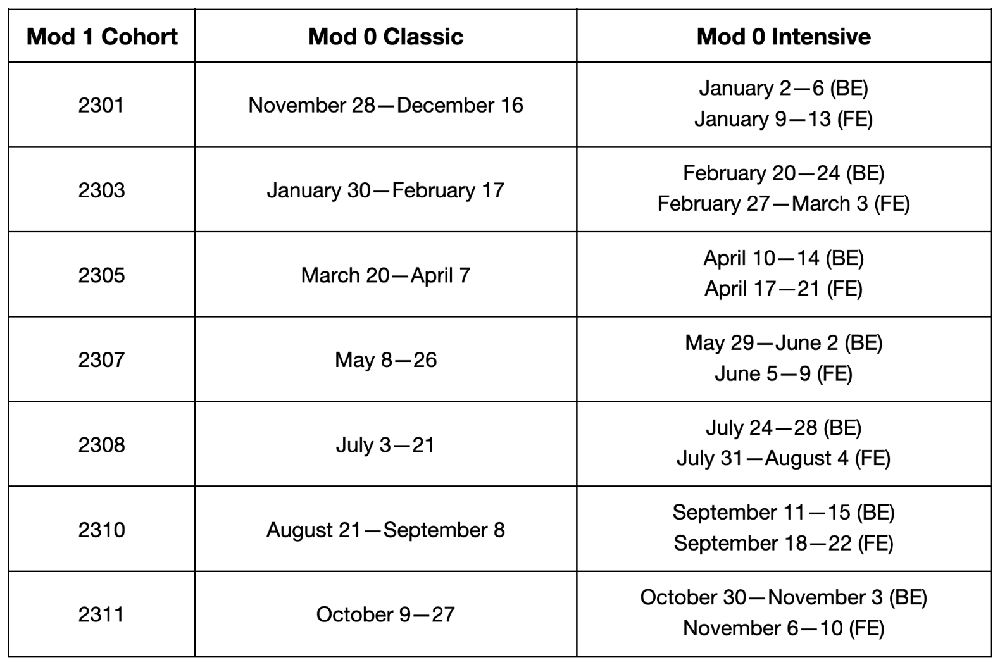

There are two formats for completing Mod 0. Both the classic version and the intensive version involve live sessions, recorded content, self-paced work, and peer-to-peer collaboration. 
- In the **classic format**, students can expect to work 18-20 hours/week during a 3-week period with live sessions in the evening. 
- In the **intensive format**, students can expect to work 10-12 hours/day during a 1-week period with live sessions in the morning.

## Courses for students enrolled in 2211 Mod 1

### Mod 0 Classic 
- October 10-October 28 (Front End & Back End)
- Live sessions in the **evening**
- Complete all assignments during a 3-week period

### Mod 0 Intensive 
- October 31-November 4 (Back End)
- November 7-November 11 (Front End)
- Live sessions in the **morning**
- Complete all assignments during 1 week

## Upcoming Mod 0 Start Dates

 
 
 