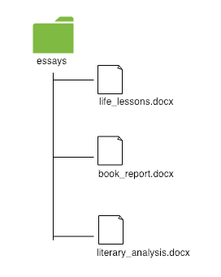
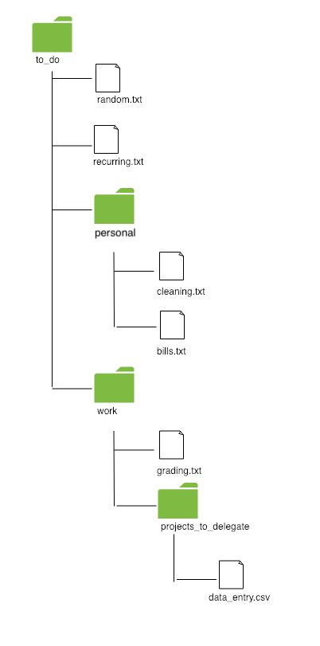
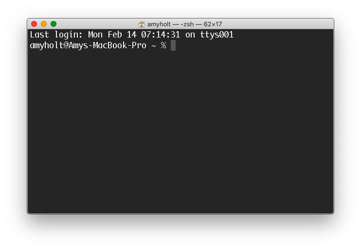
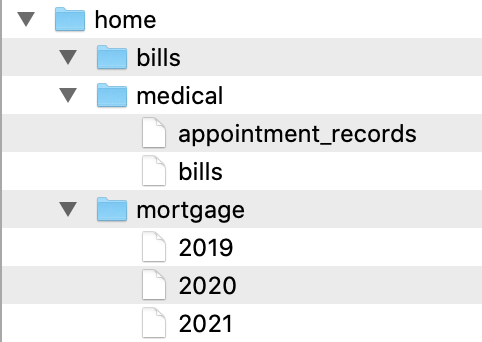
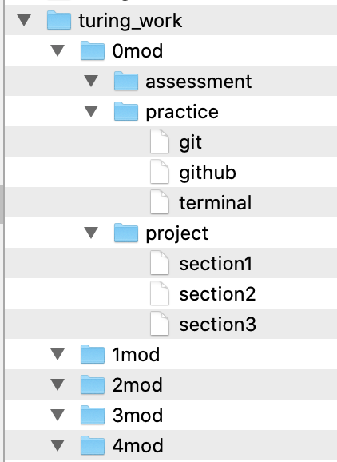

## Learning Goals

- Notate the file path of any file when provided a diagram
- Build, modify, and navigate a directory structure from the command line

## Vocabulary

- <span class="vocab">child</span>
- <span class="vocab">command</span>
- <span class="vocab">directory</span>
- <span class="vocab">file</span>
- <span class="vocab">file path</span>
- <span class="vocab">"run a command"</span>
- <span class="vocab">parent</span>
- <span class="vocab">Terminal</span>

## Files, Directories, and Paths

On your computer, you probably have many <span class="vocab">files</span> and <span class="vocab">directories</span>. Files are things like text documents, images, videos, PDFs, etc. Directories (or folders) are the structures we use to organize these files.

In the diagram below, we would say that there's a directory called `essays` that contains three files: `life_lessons.docx`, `book_report.docx`, and `literary_analysis.docx`:

<br>
<h3>Example #1</h3>
<div class="flex-container">
  <div>
    
  </div>
  <div>
    <p>A <span class="vocab">file path</span> is a way to notate where a file "lives" on your computer. This is the structure:</p>
    <pre>directory_name/file_name.extension</pre>
    <p>The file path for the first file in the diagram would be:</p>
    <pre>essays/life_lessons.docx</pre>
    <p>What is the path for <code>book_report.docx</code>?</p>
    <textarea rows="1" name="" style="width:100%;"></textarea>
    <p>What is the path for <code>literary_analysis.docx</code>?</p>
    <textarea rows="1" name="" style="width:100%;"></textarea>
  </div>
</div>
<br>

<div class="s-card s-border-yellow-500">
  <h3>Things to Note</h3>
  <ol>
    <li>A file cannot be inside of another file. This means that every part of the path <strong>before</strong> the actual file is a directory. </li>
    <li>For now, we will follow two naming conventions: </li>
    <ul>
      <li>Use lower case letters when naming directories and files.</li>
      <li>Use underscores (_) or hyphens (-) instead of spaces when naming directories and files. However, keep in mind that different languages and frameworks have different conventions. Rather than arguing over which approach is "correct" (you'll find a lot of this on the internet), it is more important to pick an approach and be consistent. For today's lesson, we'll use the underscore (_) convention.</li>
    </ul>
    <li>Folders do not have extensions (like <strong>.docx</strong> or <strong>.md</strong> or <strong>.csv</strong>, etc.). File names do have extensions.</li>
    <li>File extensions matter. A <strong>.md</strong> file will behave differently than a <strong>.docx</strong> file, which will also behave differently than a <strong>.rb</strong> file because the extensions help the operating system figure out which application can open the file and how to read it.</li>
  </ol>
</div>
<br>

<h3>Example #2</h3>
<div class="flex-container">
  <div>
    
  </div>
  <div>
    <p>The path for the grading.txt file is</p>
    <pre>to_do/work/grading.txt</pre>
    <p>What is the path for cleaning.txt?</p>
    <textarea rows="1" name="" style="width:100%;"></textarea>
    <p>What is the path for recurring.txt?</p>
    <textarea rows="1" name="" style="width:100%;"></textarea>
    <p>What is the path for data_entry.csv?</p>
    <textarea rows="1" name="" style="width:100%;"></textarea>
  </div>
</div>

<div class="s-card s-border-yellow-500">
  <h3>Things to Note</h3>
  <p>We commonly refer to directories with an analogy of <span class="vocab">parent</span> and <span class="vocab">child</span>. In the previous example, <code>to_do</code> is the parent directory of the <code>personal</code> and <code>work</code> directories. <code>projects_to_delegate</code> is a child directory of the <code>work</code> directory.</p>
</div>
<br>

## Terminal

The <span class="vocab">Terminal</span> is a program we use to give <span class="vocab">commands</span>, or directions, to the computer. We use the Terminal because it is a faster and more precise way to navigate our file systems, and certain tools can only be downloaded and accessed via the Terminal. In this lesson, you will learn 9 commonly used commands, but there are many more you'll learn throughout your time at Turing and in your career.

Your Terminal will look something like this:



<div class="s-card">
  <h3>Independent Research</h3>
  <p><em>Be prepared: You are about to be asked to go reseach a technical topic you have received no instruction on. This might feel scary! You might be wondering if it's a mistake! It's not - this is a big part of Turing's teaching and learning, and something we are sending you all the way into on your very first day. It might feel challenging or uncomfortable - sit with that feeling, embrace it, and push yourself to engage!</em></p>
  <p>Take 3 minutes (max) to research each of the following Terminal commands: <code>pwd</code>, <code>touch</code>, and <code>cd ..</code>. Take note of what you learn and any questions that arise from this research.</p>
</div>
<br>

<div class="s-card s-border-yellow-500">
  <h3>Reflection</h3>
  <ul>
    <li>How did it feel to research a technical topic?</li>
    <li>Did you struggle? If so, was the struggle productive or unproductive?</li>
    <li>Did you stick to the time limits?</li>
  </ul>
</div>
<br>

### Terminal Commands

Each command has a different utility. Some find it helpful to categorize the type of utility as "Action", "Safe/Informative", or "Destructive". Read and follow the activities provided to learn about each of the 9 commands.

#### Action Commands

- `mkdir`
- `touch`
- `clear`
- `cd`
- `cd ..`

#### Safe/Informative Commands

- `pwd`
- `ls`

#### Destructive Commands

- `rm`
- `rm -rf`

<br>

### 1. Where am I? (`pwd`)

When you open the Terminal, you will be in your home directory. Just like you can do different things at home vs. on vacation vs. at work, the location you are in within your file structure determines what actions you can take.

To figure out where you are in your computer's directory structure, run `pwd`. This command stands for "print working directory".

```
timo@Tims-MacBook-Pro:~$ pwd
/Users/timo
```

You'll see the path from the root of your computer to your current directory.

_This is classified as a "Safe" command because there is **nothing** you can mess up by running this. Ever._
<br>
<br>

### 2. Make a Directory (`mkdir`)

To make a folder using the visual interface of Finder, this is what you might do:


In the Terminal, we can make new directories with the `mkdir` command. Unlike `pwd` where we didn't need to run anything else, we'll need to add a name for the directory. Directory naming should follow a convention - we'll use all lowercase letters with no spaces; if you want to create a multi-word directory, use the underscore (\_) instead of a space.

The following commands will create two directories called `work_spreadsheets` and `latest_projects`:

```
timo@Tims-MacBook-Pro:~$ mkdir work_spreadsheets
timo@Tims-MacBook-Pro:~$ mkdir latest_projects
```

You won't get any confirmation that your directory was created; you'll just see a new command prompt ready for your next command.

<br>
<br>

### 3. Listing Contents of a Directory (`ls`)

With a visual interface (as shown in the gif above), you can easily see the contents of a directory. In the Terminal, it's a little different.

To see what is inside of a directory, we use the `ls` command, which is short for list. As an example, let's assume that we have the directories and files from this diagram on a computer:

<div class="flex-container">
  <div>
    
  </div>
  <div>
    <p>If I was in the essays directory and I ran <code>ls</code>, this is what I'd see:</p>

  <pre>timo@Tims-MacBook-Pro:~/essays$ ls
  book_projects    life_lessons.docx    notes.docx</pre>

  <p>You will only see the directories and files that are <em>directly</em> inside of the current working directory. You will not see any directories or files that are nested down the path. This is why we do not see the contents of <code>book_projects</code> listed.</p>

  <p>Now assume we're in the <code>book_projects</code> directory. If I run <code>ls</code>, I'll see this:</p>

  <pre>timo@Tims-MacBook-Pro:~/essays/book_projects$ ls
  literary_analysis.docx    book_report.docx</pre>

  </div>
</div>

`ls` is a great command to run after you've made a new directory as it will allow you to confirm you made the directory.

_This is classified as a "Safe" command because there is **nothing** you can mess up by running this. Ever._

<br>

### 4. Go Into a Directory (`cd`)

You can move into a directory using the `cd` command, which stands for "change directory". After `cd`, type the name of the directory you want to go into.

<div class="flex-container">
  <div>
    
  </div>
  <div>
    <p>For example, if I was in the <code>essays</code> directory and wanted to move into the <code>book_projects</code> directory to see my documents, I would run the following:</p>
<pre>
timo@Tims-MacBook-Pro:~/essays$ cd book_projects
timo@Tims-MacBook-Pro:~/essays/book_projects$
</pre>

<p>We see that the second command prompt now lists the path of new directory that we're in.</p>

<p>From there, if I used the <code>ls</code> command, I would be able to see the contents of my folder:</p>

<pre>
timo@Tims-MacBook-Pro:~/essays/book_projects$ ls
literary_analysis.docx    book_report.docx
</pre>
  </div>
</div>

<div class="s-card s-border-yellow-500">
  <h3>Things to Note</h3>
  <p>You can't pick any random directory from your computer to give to the <code>cd</code> command. It has to be a directory that is directly inside the current working directory (or you need to use the full path to get to that directory, which we won't talk about in this lesson).</p>
</div>
<br>

### 5. Get Out of a Directory (`cd ..`)

To get out of a directory you're in, we use `cd ..` (note the space between the d and the first dot). This means "go back up one level."

If I'm in the `book_projects` directory and I want to get back to `essays`, this is what I'd run:

```
timo@Tims-MacBook-Pro:~/essays/book_projects$ cd ..
timo@Tims-MacBook-Pro:~/essays$
```

Notice that my path no longer includes `book_projects` because I'm outside of that folder now.

>_**Note:** You never want to `cd` into a directory above your home directory. This area requires admin permissions, and there is no practical use case for being there._

<br>
<div class="s-card">
  <h3>Try It: <code>cd and cd ..</code></h3>
  <p>Using what you've learned, type a response to each prompt in the associated input field. If you aren't sure or want to check yourself, this is a great topic to bring up in your small group Slack channel.</p>
  <div class="flex-container">
    <div>
      
    </div>
    <div>
      <p>If I'm in the <code>work</code> directory, what command do I need to run to get to <code>to_do</code>?</p>
      <textarea name="" style="width:100%;"></textarea>
      <p>If I'm in the <code>projects_to_delegate</code> directory, what <strong>commands</strong> do I need to run to get to <code>to_do</code>?</p>
      <p><small>(We'll learn how to combine these momentarily)</small></p>
      <textarea name="" style="width:100%;"></textarea>
      <p>If I'm in the <code>personal</code> directory, what <strong>commands</strong> do I need to run to get to <code>projects_to_delegate</code>?</p>
      <textarea rows="3" name="" style="width:100%;"></textarea>
      <p>I'm in the <code>projects_to_delegate</code> directory. What <strong>commands</strong> do I need to run to get to <code>personal</code>?</p>
      <textarea rows="3" name="" style="width:100%;"></textarea>
    </div>
  </div>
</div>
<br>

<div class="s-card s-border-yellow-500">
  <h3>Things to Note</h3>
  <ul>
    <li>Each level in the path is separated by a <code>/</code></li>.
    <li>One can combine commands to navigate multiple levels through your directory structure.</li>
    <li>For the third example in the previous <strong>Try It</strong> section, one could navigate to the <code>projects_to_delegate</code> in a single command: <code>cd ../work/projects_to_delegate</code>.</li>
    <li>For the final example above: <code>cd ../../personal</code>.</li>
  </ul>
  <p>If you don't feel comfortable combining commands yet - that is ok! We shared the last two bullet points on how to combine commands for those who are curious about a more efficient way, but it's not an essential part of your workflow in Mod 0.</p>
</div>
<br>

### 6. Make a File (`touch`)

We know how to make directories (or folders) using the `mkdir` command. In order to make files inside of those directories, we use `touch`. `touch` needs to be provided with the name of the file being created. The following commands will create new files called `chapter_1.md` and `chapter_2.md`:

```
timo@Tims-MacBook-Pro:~/latest_projects$ touch chapter_1.md
timo@Tims-MacBook-Pro:~/latest_projects$ touch chapter_2.md
```

We don't receive any confirmation that the file was created, but we can use `ls` to see what's inside the directory:

```
timo@Tims-MacBook-Pro:~/latest_projects $ ls
chapter_1.md    chapter_2.md
```
<br>

### 7. Clear your Terminal (`clear`)

Sometimes when you've entered a lot of Terminal commands, your Terminal can get pretty cluttered. You can always use `clear` to "clean up" your Terminal workspace! The keyboard shortcut `cmd + k` does the same thing.
<br>
<br>

### 8. Remove a File (`rm`)

In the past, you've probably gotten rid of files by using the `Move to trash` button or dragging them into the trash, like this:


We can remove files from the command line by running the `rm` command. Your current working directory must contain the file you want to remove.

```
timo@Tims-MacBook-Pro:~/latest_projects $ ls
chapter_1.md  chapter_2.md
timo@Tims-MacBook-Pro:~/latest_projects $ rm chapter_1.md
```

Again, we don't get a confirmation, but if I were to run `ls` right now, the filename I provided to `rm` no longer appears because it has been removed.

```
timo@Tims-MacBook-Pro:~/latest_projects $ ls
chapter_2.md
```

<div class="s-card s-border-yellow-500">
  <h3>Things to Note</h3>
  <ul>
    <li>A file removed using the <code>rm</code> command <strong>does not</strong> go into your trash where you could restore it later.</li>
    <li>Although it may be possible to recover files deleted with <code>rm</code>, it is a difficult process requiring special tools and time. For now, assume that any file you remove using the <code>rm</code> command is permanently destroyed.</li>
  </ul>
</div>
<br>

### 9. Remove a Directory and Its Contents (`rm -rf`)

We can use `rm` to remove a file, but we use a different command when we're removing a directory. Since a directory could potentially contain other files and directories inside of it, we use `rm -rf` which stands for remove _recursively_, or go inside this directory and remove everything inside of it as well.

In order to remove a directory, you must be OUTSIDE of that directory. For example, if I'm inside a `books` directory and I want to remove it, I first need to get out of it using `cd ..`, then use the `rm -rf books`:

```
timo@Tims-MacBook-Pro:~/latest_projects/books$ cd ..
timo@Tims-MacBook-Pro:~/latest_projects$ rm -rf books
```

Now when I run `ls`, I will no longer see `books` listed.

  <div class="s-card">
    <h3>Try It: Removing files (<code>rm</code>) and directories (<code>rm -rf</code>)</h3>
    <p>Using what you've learned, type a response to each prompt in the associated input field. If you aren't sure or want to check yourself, this is a great topic to bring up in your small group Slack channel.</p>
    <div class="flex-container">
      <div>
        
      </div>
      <div>
        <p><strong>For this scenario, assume that each question is independent of the rest, and that the starting point is always the diagram to the left.</strong></p>
        <p>I'm in <code>to_do</code>. What do I run to remove <code>random.txt</code>?</p>
        <textarea rows="1" name="" style="width:100%;"></textarea>
        <p>I'm in <code>to_do</code>. What do I run to remove the <code>personal</code> directory?</p>
        <textarea rows="1" name="" style="width:100%;"></textarea>
        <p>I'm in the <code>work</code> directory. What command(s) do I run to remove the <code>personal</code> directory?</p>
        <textarea rows="2" name="" style="width:100%;"></textarea>
        <p>I'm in the <code>projects_to_delegate</code> directory. What command(s) do I run to remove the directory I'm currently in?</p>
        <textarea rows="2" name="" style="width:100%;"></textarea>
        <p>I'm in <code>projects_to_delegate</code>. What command(s) do I need to run to remove the <code>cleaning.txt</code> file?</p>
        <textarea rows="4" name="" style="width:100%;"></textarea>
      </div>
    </div>
  </div>

<br>

## Practice

In your Terminal, recreate the file structures shown in the diagrams below. Assume that the extension for any files notated is `.md`.

### Challenge #1

<br>
<br>
<br>

### Challenge #2

<br>
<br>
<br>

## Check For Understanding

If you haven't already, create a `terminal_lesson.md` file in your Mod 0 directory. Answer these questions in that file.

1. How do you quickly open up your Terminal on your computer? 
1. From your home directory, you have a `Turing` directory, then a `Mod 0` directory. How would you create another directory inside the `Mod 0` directory called `Projects`? (Note: there may be multiple correct answers.)
1. Working off the above question, how would you add a new file to the `Projects` directory called `first_project.md`?
1. If you were in the `Projects` directory, what would you type to get back to the `Turing` directory? 
1. From your `Turing` directory, how would you view all the directories and files within that `Turing` directoy? 


<br><br><br><br><br>