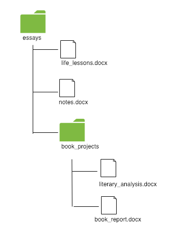

<div class="goals-agenda">
  <div>
    <h3>Goals</h3>
    <strong>By the end of this session, you will be able to:</strong>
    <ul>
      <li>notate file paths from diagrams</li>
      <li>navigate through directories from the command line</li>
      <li>make and remove files and directories from the command line</li>
      <li>define and identify methods for a class</li>
      <li>explain the purpose of git</li>
      <li>initialize, add, and commit changes in a local repository  </li>
    </ul>
  </div>
  <div>
    <h3>Agenda</h3>
    <ul>
      <li><strong>10 min: </strong>Housekeeping, Feedback, and Goals</li>
      <li><strong>10 min: </strong>Classes, Attributes and Methods</li>
      <li><strong>15 min: </strong><a href="#filesdirectories">Files, Directories, and Paths</a></li>
      <li><strong>35 min: </strong><a href="#terminalcommandline">Terminal and Command Line</a></li>
      <li><strong>5 min: </strong>Break</li>
      <li><strong>40 min: </strong><a href="#git">Git Basics</a></li>
      <li><strong>5 min: </strong><a href="#homework">Homework Preview</a></li>
    </ul>
  </div>
  <div>
    <h3>Materials</h3>
    <ul>
      <li>Notebook</li>
      <li>Writing instrument</li>
      <li>Laptop</li>
      <li>Headphones & mic</li>
    </ul>
  </div>
</div>

## Housekeeping, Feedback, and Goals

- In the chat, post a keyboard shortcut that you practiced and now feel comfortable using. 
- You will be screensharing your terminal today. If you have programs open that might be distracting (or you have confidential work open), close or minimize those programs now.
- Questions during the session? Click "raise hand" for whole-group question, or message the non-presenting host for an individual question.
- We'll stay on the call at the end of today's session for any Qs that are not addressed during the lesson.

### Wins

- Solid understanding of data types 
- Solid understanding of Googling + filtering tips specific to programming 
- Sharing iteration diagrams in channel (keep sharing!)

### Follow-Ups

- Iteration is confusing: 
    - What collection are you starting with?
    - What are you doing to each item in the collection?
    - You don't need to memorize syntax of iteration at this point; you'll see more of it in the capstone and Mod 1
- Sessions are designed to move fast
- More breakout room time

### Today's Goals

(See above)

<div class="try-it">
  <h3>Intros, Review, and Icebreaker (5 minutes)</h3>
  <p>1. Introduce yourself: name, pronouns</p>
  <p>2. What was the highlight of your weekend?</p>
  <p>3. Accountability review: what were the skills/processes that you decided to focus on last week, and how are you progressing toward mastery of those skills?</p>
</div>

<a name="classes"></a>
## Classes (Intro: Part II)

**Note**: This is a topic that we will revisit in bite-size chunks leading up to Session 5. We will not talk about the technical aspects of how classes play a part in programming today; instead, we will apply the terminology and concepts to real life.

### Class and Attribute Review

<div class="try-it">
  <h3>Try It: Classes</h3>
  <p>Post one sentence in the chat using this structure:</p>
  <p>______, ________, and _______ (instances) are different versions of a ________ (class).</p>
  <p>For example: My Old Navy sweatshirt and my American Giant sweatshirt (instances) are different versions of a sweatshirt (class).</p>
</div>

<div class="try-it">
  <h3>Try It: Attributes</h3>
  <p>Post one sentence in the chat about your class using this structure:</p>
  <p>Each _______ (class) has a _______, ________, and ________ (attributes).</p>
  <p>For example: Each Sweatshirt (class) has a color, brand, and size (attributes).</p>
</div>

### Methods of Classes

A <span class="vocab">method</span> of a class define **behavior/actions**. Methods are generally verbs (action words or very short action phrases). Methods generally answer the questions "What things can instances of this specific class do?" or "What can be done to instances of this specific class?"

For example: 

- Each **child** (class) can greet, run, and learn (methods). 
- Each **sweatshirt** (class) can be purchased, be returned, be washed, and be repaired (methods).
- Each **book** (class) can be read, have the price updated, and be highlighted (methods). 
- Each **bank account** (class) can have money deposited, can have money withdrawn, can be opened, can be closed, and can change ownership (methods).

<div class="try-it">
  <h3>Try It: Methods</h3>
  <p>Post one sentence in the chat about your class using this structure:</p>
  <p>Each _______ (class) can ___________, __________, and ___________.</p>
</div>

<a name="filesdirectories"></a>
## Files, Directories, and Paths

On your computer, you probably have many <span class="vocab">files</span> and <span class="vocab">directories</span>. Files are things like text documents, images, videos, PDFs, etc. Directories (or folders) are the structures we use to organize these files. 

In the diagram below, we would say that there's a directory called `essays` that contains three files: `life_lessons.docx`, `book_report.docx`, and `literary_analysis.docx`: 

<hr>
<h4>Example #1</h4>
<div class="flex-container">
  <div>
    
  </div>
  <div>
    A <span class="vocab">file path</span> is a way to notate where a file "lives" on your computer. This is the structure:
    <pre>directory_name/file_name.extension</pre>
    The file path for the first file in the diagram would be:
    <pre>essays/life_lessons.docx</pre>
    <p>What is the path for book_report.docx?</p>
    <textarea rows="1" name="" style="width:100%;"></textarea>
    <p>What is the path for literary_analysis.docx?</p>
    <textarea rows="1" name="" style="width:100%;"></textarea>
  </div>
</div>
<div class="things-to-note">
  <h4>Things to Note</h4>
  <ol>
    <li>A file cannot be inside of another file. This means that every part of the path *before* the actual file is a directory. </li>
    <li>For now, we will follow two convention rules: </li>
    <ul>
      <li>Use lower case letters when naming directories and files</li>
      <li>Use underscores (_) or hyphens (-) instead of spaces when naming directories and files. However, keep in mind that different languages and frameworks have different conventions. Rather than arguing over which approach is "correct" (you'll find a lot of this on the internet), it is more important to pick an approach and be consistent. For today's lesson, we'll use the underscore (_) approach.</li>
    </ul>
    <li>Folders do not have extensions (like <strong>.docx</strong> or <strong>.txt</strong> or <strong>.csv</strong>, etc.) but file names do have extensions.</li>
    <li>File extensions matter. A <strong>.md</strong> file will behave differently than a <strong>.docx</strong> file, which will also behave differently than a <strong>.txt</strong> file because the extensions help the operating system figure out which application can open the file. </li>
  </ol>
</div>
<hr>
<h4>Example #2</h4>
<div class="flex-container">
  <div>
    
  </div>
  <div>
    <p>The path for the grading.txt file is</p>
    <pre>to_do/work/grading.txt</pre>
    <p>What is the path for cleaning.txt?</p>
    <textarea rows="1" name="" style="width:100%;"></textarea>
    <p>What is the path for random.txt?</p>
    <textarea rows="1" name="" style="width:100%;"></textarea>
    <p>What is the path for recurring.txt?</p>
    <textarea rows="1" name="" style="width:100%;"></textarea>
    <p>What is the path for bills.txt?</p>
    <textarea rows="1" name="" style="width:100%;"></textarea>
    <p>What is the path for data_entry.csv?</p>
    <textarea rows="1" name="" style="width:100%;"></textarea>
  </div>
</div>

<hr>
<a name="terminalcommandline"></a>
## Terminal and Command Line

The <span class="vocab">terminal</span> is what we call a command line interface. Basically, that's a fancy way of saying that it's the program we use to give commands to the computer. The <span class="vocab">command line</span> is a text-based way to make files, make directories, and run applications, among other things. 

Your terminal will look something like this:


<a name="profiledetour"></a>
The text `timo@Tims-MacBook-Pro:~$` is called the command prompt, and the `$` indicates that it's ready to accept input.

**Something to note:** When copying and pasting commands from the internet, do not include the `$`. It is meant to symbolize that a command is run from the terminal.

If you want to further customize your command prompt, check out the [EZPrompt Generator](http://ezprompt.net/).

### Commands

In this section on command prompts, we'll learn (or review) the commands below. We'll look at all 10 together (take notes!), then you'll go into breakout rooms to practice them. 

Action Commands
<ul>
  <li><a href="#mkdir" title="">mkdir</a></li>
  <li><a href="#cd" title="">cd</a></li>
  <li><a href="#cddot" title="">cd ..</a></li>
  <li><a href="#touch" title="">touch</a></li>
  <li><a href="#echo" title="">echo</a></li>
  <li><a href="#cat" title="">cat</a></li>
</ul>

Safe/Informative Commands
<ul>
  <li><a href="#pwd" title="">pwd</a></li>
  <li><a href="#ls" title="">ls</a></li>
</ul>

Destructive Commands
<ul>
  <li><a href="#rm" title="">rm</a></li>
  <li><a href="#rmrecursive" title="">rm -rf</a></li>
</ul>

<a name="pwd"></a>
### 1. Where am I? (pwd)

When you open the terminal, you will be in your home directory. Being in various directories will allow you to do different things, just like you can do different things at home vs. on vacation vs. at work. 

To figure out where you are in your computer's directories, type `pwd` after the command prompt. `pwd` stands for "print working directory"

```
timo@Tims-MacBook-Pro:~$ pwd
/Users/timo
```

You'll see the path from the root of your computer to your current directory. 

<a name="mkdir"></a>
### 2. Make a Directory (mkdir)

To make a folder using the visual interface of Finder, this is what you might do:


We can make new directories with the `mkdir` command. Unlike `pwd` where we didn't need to type anything else, we'll need to add a name for the directory. Keep your directories lowercase with no spaces. If you need to use a space, use the underscore (\_).

For example, the following two commands will create two directories called `work_spreadsheets` and `latest_projects`:

```
timo@Tims-MacBook-Pro:~$ mkdir work_spreadsheets
timo@Tims-MacBook-Pro:~$ mkdir latest_projects
```

You won't get any confirmation that your directory was created -- you'll just see a new command prompt ready for your next comamnd. 

<a name="ls"></a>
### 3. Listing Contents of a Directory (ls)

With a visual interface (as shown in the gif above), you can easily see the contents of a directory. On the command line, it's a little different.

To check what's inside of a directory, we use the `ls` command which stands for list (although I like to think to myself: "list stuff"). As an example, let's assume that I have the directories and files from this diagram on my computer:

<div class="flex-container">
  <div>
    
  </div>
  <div>
    If I was in the essays directory and I typed ls, this is what I'd see:

    <pre>timo@Tims-MacBook-Pro:~/essays$ ls
    book_projects    life_lessons.docx    notes.docx</pre>

    <p>You will only see the directories and files that are directly inside of where you are. You will not see any directories or files that are nested down the path. This is why we do not see the contents of book_projects listed.</p>

    <p>Now assume we're in the book_projects directory. If I type ls, I'll see this:</p>

    <pre>timo@Tims-MacBook-Pro:~/essays/book_projects$ ls
    literary_analysis.docx    book_report.docx</pre>

  </div>
</div>

<a name="cd"></a>
### 4. Go Into a Directory (cd)

You can move into a directory using the `cd` command, which stands for "change directory". After `cd`, type the name of the directory you want to go into.

<div class="flex-container">
  <div>
    
  </div>
  <div>
    For example, if I was in the <code>essays</code> directory and wanted to move into the <code>book_projects</code> directory to see my documents, I would type this: 
<pre>
timo@Tims-MacBook-Pro:~/essays$ cd book_projects
timo@Tims-MacBook-Pro:~/essays/book_projects$ 
</pre>

We see that the second command prompt now lists the path of new directory that we're in.

From there, if I used the <code>ls</code> command, I would be able to see the contents of my folder:

<pre>
timo@Tims-MacBook-Pro:~/essays/book_projects$ ls
literary_analysis.docx    book_report.docx
</pre>
  </div>
</div>

<div class="things-to-note">
  <h4>Things to Note</h4>
  <ol>
    <li>You can't pick any random directory from your computer to give to the ls command. It has to be a directory inside wherever you currently are (or you need to use the full path to get to that directory, which we won't talk about today).</li>
  </ol>
</div>

<a name="cddot"></a>
### 5. Get Out of a Directory (cd ..)

To get out of a directory you're in, we use `cd ..` (with a space between the d and the first dot). This means "go back up one level." 

If I'm in the `book_projects` directory and I want to get back to `essays`, this is what I'd type:

```
timo@Tims-MacBook-Pro:~/essays/book_projects$ cd ..
timo@Tims-MacBook-Pro:~/essays$
```

Notice that my path no longer includes `book_projects` because I'm outside of that folder now. 

<div class="try-it">
  <h3>Try It: cd and cd ..</h3>
  <p>Let's try to figure out the following scenarios together.</p>
  <div class="flex-container">
    <div>
      
    </div>
    <div>
      <p>If I'm in the <code>work</code> directory, what do I need to type to get to <code>to_do</code>?</p>
      <textarea name="" style="width:100%;"></textarea>
      <p>If I'm in the <code>projects_to_delegate</code> directory, what <strong>two commands</strong> do I need to type to get to <code>to_do</code>?</p>
      <p><small>(We'll learn how to combine these momentarily)</small></p>
      <textarea name="" style="width:100%;"></textarea>
      <p>I'm in the <code>home</code> directory. What <strong>three commands</strong> do I need to type to get to <code>projects_to_delegate</code>?</p>
      <p><small>(We'll learn how to combine these momentarily)</small></p>
      <textarea rows="3" name="" style="width:100%;"></textarea>
      <p>I'm in the <code>projects_to_delegate</code> directory. What <strong>three commands</strong> do I need to type to get to <code>home</code>?</p>
      <p><small>(We'll learn how to combine these momentarily)</small></p>
      <textarea rows="3" name="" style="width:100%;"></textarea>
    </div>
  </div>
</div>

<div class="things-to-note">
  <h4>Things to Note</h4>
  <ul>
    <li>One can combine commands to navigate multiple levels through your directory structure. </li>
    <li>For the third example in the previous <strong>Try It</strong> section, one could navigate to the <code>projects_to_delegate</code> directory as long as one knows the path:</li>
    <code>cd ../work/projects_to_delegate</code>
    <li>For the fourth and final example above:</li>
    <code>cd ../../home</code>   
    <li>Each level in the path is spearated by a <code>/</code></li> 
  </ul>
</div>

<a name="touch"></a>
### 6. Make a File (touch)

We know how to make directories (or folders) using the `mkdir` command. In order to make files inside of those directories, we use `touch`. The following two commands show how I would make two new files, `chapter_1.txt` and `chapter_2.txt`:

```
timo@Tims-MacBook-Pro:~/latest_projects$ touch chapter_1.txt
timo@Tims-MacBook-Pro:~/latest_projects$ touch chapter_2.txt
```

We don't see any confirmation that the file was created, but we can use `ls` to see what's inside the directory:

```
timo@Tims-MacBook-Pro:~/latest_projects $ ls
chapter_1.txt    chapter_2.txt
```

<a name="echo"></a>
### 7. Add text to a file (echo)

Normally, we will use our text editor (Atom or Sublime) to add text content to a file. However, you can also add text content using the <code>echo</code> command. Note that you *must* use quotation marks to indicate what text you want to add to the file. 

```
timo@Tims-MacBook-Pro:~/latest_projects $ echo "Call me Ishmael" >> chapter_1.txt
```

You won't see any confirmation, but that text inside the quotation marks will now be inside of the `chapter_1.txt` file. 

<a name="echo"></a>
### 8. See the text in a file (cat)

If we want to check what text is inside of a file, we can use <code>cat</code>:

```
timo@Tims-MacBook-Pro:~/latest_projects $ cat chapter_1.txt
It was the best of times, it was the worst of times
```

<a name="rm"></a>
### 9. Remove a File (rm)

In the past, you've probably gotten rid of files by using the `Move to trash` command or dragging them into the trash, like this:


We can remove files from the command line using the `rm` command, like this:

```
timo@Tims-MacBook-Pro:~/latest_projects $ rm chapter_1.txt
```

Again, we don't get a confirmation, but if I were to `ls` right now, nothing would appear since the directory is now empty. 

```
timo@Tims-MacBook-Pro:~/latest_projects $ ls
chapter_2.txt
```

<div class="things-to-note">
  <h4>Things to Note</h4>
  <ul>
    <li>A file removed using the <code>rm</code> command <strong>does not</strong> go into your trash can where you could restore it later.</li> 
    <li>Although it may be possible to recover files deleted with <code>rm</code>, it is a difficult process requiring special tools and time. For now, assume that any file you remove using the <code>rm</code> command is gone for good.</li>
  </ul>
</div>

<a name="rmrecursive"></a>
### 10. Remove a Directory and Its Contents (rm -rf)

We can use `rm` to remove a file, but we use a different command when we're removing a directory. Since a directory could potentially contain other files and directories inside of it, we use `rm -rf` which stands for remove recursively, or go inside this directory and remove everything inside of it as well. 

In order to remove a directory, you must be OUTSIDE of that directory. For example, if I'm inside a `books` directory and I want to remove it, I first need to get out of it using `cd ..`, then use the `rm -rf books`:

```
timo@Tims-MacBook-Pro:~/latest_projects/books$ cd ..
timo@Tims-MacBook-Pro:~/latest_projects$ rm -rf books
```

Now when I type `ls`, I will no longer see `books` listed.

<div class="try-it">
  <h3>Try It: Removing files (rm) and directories (rm -rf)</h3>
  <div class="flex-container">
    <div>
      
    </div>
    <div>
      <p>We'll work through these exercises together.</p>
      <strong>For this scenario, assume that each question is independent of the rest, and that the starting point is always the diagram to the left.</strong>
      <p>I'm in <code>to_do</code>. What do I type to remove <code>random.txt</code>?</p>
      <textarea rows="1" name="" style="width:100%;"></textarea>
      <p>I'm in <code>to_do</code>. What do I type to remove the <code>home</code> directory?</p>
      <textarea rows="1" name="" style="width:100%;"></textarea>
      <p>I'm in the <code>work</code> directory. What <strong>two commands</strong> do I type to remove the <code>home</code> directory?</p>
      <textarea rows="2" name="" style="width:100%;"></textarea>
      <p>I'm in the <code>projects_to_delegate</code> directory. What <strong>two commands</strong> do I type to remove the directory I'm currently in?</p>
      <textarea rows="2" name="" style="width:100%;"></textarea>
      <p>I'm in <code>projects_to_delegate</code>. What <strong>four commands</strong> do I need to type to remove the <code>cleaning.txt</code> file?</p>
      <textarea rows="4" name="" style="width:100%;"></textarea>
    </div>
  </div>
</div>


### Putting it All Together

<p>At this point, we'll split into breakout rooms. The person whose name first name starts with the letter closest to T will share their screen by clicking the green "Share Screen" button. We will call this person the <span class="vocab">driver</span>. Every other person in the room will be a <span class="vocab">navigator</span>.</p>

<p>The driver will be the person typing the commands, but the navigators should be the ones who brainstorm what comes next or what to type. In addition to naming the steps, discuss <strong>why</strong> you are doing each step, or <strong>what</strong> exactly is taking place in each step.</p>

<p>If you are already comfortable with commands, your challenge during the breakout is somewhat more difficult: your goal is to focus on your explanations, communication, and ability to gauge whether or not another person understands you.</p>

#### Challenge #1

1. Type `cd` to get to your home directory (you'll probably already be here, but do it just to be sure)
1. Make a new directory called `terminal_practice`
1. Move into that directory
1. Print your current directory
1. Make a file called `favorite_foods.txt`
1. List the contents of your directory (you should see just your `favorite_foods.txt` file appear)
1. Use the echo command to add your #1 favorite food to the file
1. Use the echo command again to add your #2 favorite food to the file
1. Use the cat command to show what's in that file
1. Delete the `favorite_foods.txt` file
1. Get back out of the `terminal_practice` directory
1. Remove the `terminal_practice` directory

#### Challenge #2

For this next challenge, the person whose name is next closest to the letter T will share their screen and become the driver. 

1. Type `cd` to get to your home directory (you'll probably already be here, but do it just to be sure)
1. Make a new directory called `my_first_projects`
1. Make another new directory called `my_other_projects`
1. List the contents of your directory (you should see these two directories you just made in the list)
1. Remove the `my_other_projects` directory
1. Move into the `my_first_projects` directory
1. Make a file called `ruby.txt`
1. Make a file called `javascript.txt`
1. Make a file called `python.txt`
1. List the contents of your directory (you should see the three files you just created)
1. Delete the `ruby.txt` file but leave the others
1. Get back out of the `my_first_projects` directory
1. List the contents of your directory (you should see `my_first_projects`)
1. Remove the `my_first_projects` directory

#### Challenge #3

The person who has not yet been the driver will share their screen.

1. Type `cd` to get to your home directory (you'll probably already be here, but do it just to be sure)
1. Make a new directory called `session3_practice`
1. Move into the `session3_practice` directory
1. Print the path to your current directory
1. Make a file called `terminal.txt`
1. List the contents of your directory (you should see the `terminal.txt` file you just created)
1. Add the text "The terminal is an interface to give commands to the computer" to the `terminal.txt` file
1. Use the `cat` command to check that the text got added to the `terminal.txt` file
1. Get back out of the `session3_practice` directory
1. Remove the `session3_practice` directory


## BREAK

Turn off your mics and videos and walk away from the computer. Stand up, stretch, drink water. Do a few sit-ups, squats, push-ups, jumping jacks, arm circles, stress ball squeezes, or whatever else moves your body. 
<hr>
<a name="git"></a>
## Git

<span class="vocab">Git</span> is a Version Control System (VCS). It allows you to save work on your project, and reference previous states of a project if needed. Normally when we save something on our computer, the newer version overwrites the older version. This is problematic if we need to look back at an earlier version. Git solves this problem by providing you multiple save points. You can get the current version, and ANY previous version. Git’s philosophy: never lose anything.

Git works similarly to the way that Google Docs tracks changes across time. Let's take a brief detour to [this Google doc](https://docs.google.com/document/d/1GY5lg6kVY7JzD9qr0kcn_Ct7St-USf72JxTFQ6hu7KQ/edit?usp=sharing). 

#### Why Use Git?

There are numerous reasons to use git. Among them:

- The ability to "go back in time" to previous versions of your code if you break something
- The ability to "go back in time" to previous versions of your code if you change your mind about a feature
- The ability to chunk parts of your work so that you can choose from chunks to keep at a later time
- The ability to work collaboratively on the same project (even the same files!)
- The ability to use branches to separate features of a program
- The ability to track who made specific changes to specific files

In this section on git, we'll learn (or review) these git comamnds: 

Action Commands
<ul>
  <li><a href="#init" title="">git init</a></li>
  <li><a href="#add" title="">git add</a></li>
  <li><a href="#commit" title="">git commit</a></li>
</ul>

Safe Commands
<ul>
  <li><a href="#status" title="">git status</a></li>
  <li><a href="#diff" title="">git diff</a></li>
</ul>

<div class="things-to-note">
  <h4>Things to Note</h4>
  <p>Git has a steep learning curve, and it can be super confusing at the beginning. Tonight's lesson is not meant to make you a git master, but it will expose you to the basic git commands and workflow. Most likely, you will not have the commands or workflow memorized after tonight.</p>
  <p>To get comfortable with git (just like with anything else), you will need to put in hours of practice. It's an excellent idea to go back over this lesson (either in print or recording) multiple times.</p>
</div>

Watch and take notes during the demonstration of the git workflow. After the demonstration, we'll move into breakout rooms where you'll get to try with your group. 

### Getting Set Up

We'll start with a directory called `notes` with a file inside called `things_to_remember.txt`.

<a name="init"></a>
### 1. Start Tracking a Directory With Git (<span class="vocab">git init</span>)

By default, your changes will not be tracked. In order to tell git that we want to start tracking something, we need to initialize git in a directory. 

```
timo@Tims-MacBook-Pro:~/notes$ git init
Initialized empty Git repository in /Users/timo/notes/.git/
```

This means git will now be available to use to track changes in the `notes` directory. This does **not** mean that git is tracking anything yet. Git is now prepared to track activity in th `notes` directory

*NOTE*: If you don't see this message when you try `git init`, it means you have not set up git on your computer. 

<div class="things-to-note">
  <h4>Things to Note</h4>
  <div class="flex-container">
    <div>
      
    </div>
    <div>
      <p>1. You only need to initialize a directory once in order to track everything else inside of it. </p>
      <p>For example, if I typed this while in the essays directory:</p>
      <pre>timo@Tims-MacBook-Pro:~/essays$ git init</pre>
      <p>Then every file inside that directory, regardless of how deeply nested, would be available for git tracking.</p>
      <p>2. Empty directories are <strong>not</strong> tracked by git. Therefore, if you create a directory but there's nothing inside of it, git will ignore it. Git will only track it when there is a file inside of the directory.</p>
    </div>
  </div>
  <br>
  <p>3. What happens if you accidentally initialize git in a directory where you didn't intend?</p>
  <p>When you type <code>git init</code>, a directory called <code>.git</code> is created inside of that folder. You can't see this folder using the ls command since it's a hidden folder. Everything that starts with "." is hidden. Instead, you can type <code>ls -a</code> which will display all hidden and visible files and directories.</p>
  <p>In an git initialized directory, you'll see a <code>.git</code> directory. To remove git tracking, you would type:</p>
  <code>rm -rf .git</code>
  <p>This removes the git directory, and you are no longer using git to track your project. If you accidentally run <code>git init</code> in your home directory, and start tracking most of the files and directories on your entire computer, then remember to run <code>rm -rf .git</code> from your home directory. One way to tell if you've accidentally initialize git in your home directory is to first go home by running:<code>cd ~</code> and then run: <code>git status</code>. If you see files being tracked but not staged for commit, then you need to remove the .git folder as layed out above.However, if your terminal returns:<code>fatal: Not a git repository (or any of the parent directories): .git</code>, then you are all good.</p>
</div>

<a name="status"></a>
### 2. Check the Status (<span class="vocab">git status</span>)

When you want to see what git is tracking and the current status of files, you can use `git status`:

```
timo@Tims-MacBook-Pro:~/notes$ git status
On branch master

No commits yet

Untracked files:
  (use "git add <file>..." to include in what will be committed)

  things_to_remember.txt

nothing added to commit but untracked files present (use "git add" to track)
```

`No commits yet` means that we haven't asked git to save a version yet. You can think of a <span class="vocab">commit</span> as a snapshot of your work at a certain point in time. In the Google Doc, each save point was a commit. So far, we have no commits for our `notes` project.

`Untracked files` refers to the fact that even though we initialized a git repository, we haven't started tracking anything yet. It lists the files that are available to track. (Also note "untracked files present" near the bottom).

<div class="things-to-note">
  <h4>Things to Note</h4>
  You can type <code>git status</code> as many times as you want, whenever, wherever. It it a safe command that will not change anything about your tracking.
</div>

Let's talk briefly about this diagram from the git documentation. This diagram shows what you can do **after** you have initialized git: 


<small><em>Source: https://git-scm.com/book/en/v2/Git-Basics-Recording-Changes-to-the-Repository</em></small>

<a name="add"></a>
### 3. Add a File to Track (<span class="vocab">git add &lt;filename&gt;</span>)

Let's add one of the files that we want to track to the <span class="vocab">staging area</span>. Google's dictionary defines "staging area" as "a stopping place or assembly point en route to a destination". If you've ever run a race, you know that the staging area is the place where all of the runners gather before the race begins. It's a place to make sure everything is good to go before continuing on. 

We will add our file to the staging area. 

```
timo@Tims-MacBook-Pro:~/notes$ git add things_to_remember.txt
timo@Tims-MacBook-Pro:~/notes$ git status
On branch master

No commits yet

Changes to be committed:
  (use "git rm --cached <file>..." to unstage)

  new file:   things_to_remember.txt

```

Notice the "changes to be committed" section: It tells us that we have a new file, `things_to_remember.txt`, that is ready to be committed. We can say that the `things_to_remember.txt` file is in the <span class="vocab">git staging area</span>. That means no changes are tracked yet, but we're ready to take a snapshot of it (we'll do this next).

This may seem silly right now, given that we only have one file -- why not just commit the file? Why do we have to add it first? Let's take a [small detour](https://gist.github.com/rwarbelow/e1340ca3eeb616851a1a48221f48b67b).


<a name="commit"></a>
### 4. Take a Snapshot in Time (<span class="vocab">git commit -m &lt;message&gt;</span>)

Now that our file is in the staging area, let's tell git that we're ready to commit (take a snapshot of this moment to save). It's good practice to use "Initial Commit" for your very first commit in each repository. 

```
timo@Tims-MacBook-Pro:~/notes$ git commit -m 'Initial commit'
[master (root-commit) b7654a6] Initial commit
 1 file changed, 1 insertion(+)
 create mode 100644 things_to_remember.txt
```

Now if I look at my git status, this is what I see:

```
timo@Tims-MacBook-Pro:~/notes$ git status
On branch master
nothing to commit, working tree clean
```

Let's figure out on the diagram what we just did:

 

<a name="diff"></a>
### 5. Making File Changes, Adding New Commits, and Viewing Those Changes By Using (<span class="vocab">git diff &lt;filename&gt;</span>)
Now that we have our initial commit (or snapshot in time), let's make a change to one of our files.

Type this from the command line:

```
echo "Be kind" >> things_to_remember.txt
echo "Work hard" >> things_to_remember.txt
```

Your working directory now has changes that differ from what our file looked like the last time we committed (or took a snapshot).

```
timo@Tims-MacBook-Pro:~/notes$ git diff things_to_remember.txt
diff --git a/things_to_remember.txt b/things_to_remember.txt
index e69de29..9ffd068 100644
--- a/things_to_remember.txt
+++ b/things_to_remember.txt
@@ -0,0 +1,2 @@
+Be kind
+Work hard
```

Then add your changes and commit them using an imperative verb that starts with a capital letter and a short commit message explaining what you did. 

The basic git workflow is this:

1. Make file changes (for today, do this using the `echo` command)
1. Check the `git status` to see what files are unstaged
1. Check the `git diff <filename>` to see what changes have happened since the last commit
1. `git add <whatever file you want to stage>`
1. Check the `git status` to make sure the correct files are in the staging area
1. `git commit -m 'Message about your changes'` to commit the changes


<div class="try-it">
  <h3>Try It: Git Together</h3>
  <p>At this point, we'll split into breakout rooms. The person whose name is first alphabetically will start by sharing their screen, <strong>unless</strong> this person already has significant git experience. Whoever is sharing their screen will be called the <span class="vocab">driver</span>. Every other person in the room will be a <span class="vocab">navigator</span>.</p>

  <p>The driver will be the person typing the commands, but the navigators should be the ones who brainstorm what comes next or what to type. In addition to naming the steps, discuss <strong>why</strong> you are doing each step, or <strong>what</strong> exactly is taking place in each step.</p>

  <p>If you are already comfortable with git, your challenge during the breakout is somewhat more difficult: your goal is to focus on your explanations, communication, and ability to gauge whether or not another person understands you.</p>
  <ol>
    <li>Get back to your home directory by typing <code>cd</code></li>
    <li>Create a new directory called <code>to_do</code>. Inside of that directory, create a file called <code>tasks.txt</code>.</li>
    <li>Initialize git inside of the <code>to_do</code> directory so that we have git available to track changes.</li>
    <li>Before you check the status, predict what it will say. Then, check the current status.</li>
    <li>Add <code>tasks.txt</code> to the staging area.</li>
    <li>Make your first commit in this directory.</li>
    <li>Before you check the status, predict what it will say. Then, check the current status.</li>
    <li>Use the echo command to add three separate tasks to <code>tasks.txt</code>.</li>
    <li>Before you check the status, predict what it will say. Then, check the current status.</li>
    <li>Before you check the difference between your last commit and what the file looks like now, predict what it will say. Then, check the diff.</li>
    <li>Add the changes to the staging area.</li>
    <li>Before you check the status, predict what it will say. Then, check the current status.</li>
    <li>Commit the changes using a properly formatted commit message.</li>
    <li>Before you check the status, predict what it will say. Then, check the current status.</li>
  </ol>
  <p><strong>Done?</strong> Switch drivers and try the process again!</p>
</div>

<div class="things-to-note">
  <h4>Things to Note: Oh no, my terminal is broken!</h4>
  <ol>
    <li> It is highly likely you will make mistakes in the terminal. Do not fret, there are a few tools to save you when you inevitably receive unexpected feedback or behavior from the terminal.</li>
    <li><code>control + C</code> shortcut will stop most terminal tasks and bring you back to your current directory with no harm done. Try this first when you encounter unexpected behavior.</li>
    <li>At some point your terminal will look like it does in the photo below. This is Vim land. Vim is a text editor within your terminal that is beyond the scope of mod-0. When you find yourself here, you can type: <code>:q</code>, which stands for quit in Vim, and then hit enter to exit Vim. Sometimes, if you've already typed some characters, you need to use <code>control + C</code>in order to get to a point within Vim where <code>:q</code> or <code>:qa!</code>, which is the command to quit and abandon changes, will successfully exit Vim.</li>
      
  </ol>
</div>

## Close Out

Understanding git and the workflow can be tricky at first; however, this pattern is one that you will come to memorize over time. As you are memorizing the steps, be sure that you know **what** each step does.

Today (and during Mod 0), we'll just be moving forward in time using git. We won't learn how to go back in time, but it's important to understand and master making small commits before adding in new git functionality. 

We do not expect you to have these steps and reasons memorized right now. You can always reference back to this tutorial (or other tutorials that you find online). The more you practice, the easier it will become. 

<a name="homework"></a>

## Homework

Find the homework in your Mod 0 Project Board. Post in the Mod 0 Slack channel if you're stuck (and don't be afraid to help each other out). 
