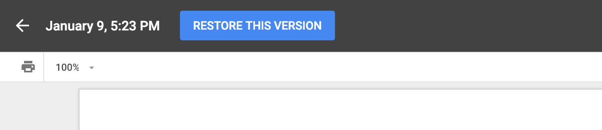

<div class="goals-agenda">
  <div>
    <h3>Goals</h3>

    <strong>By the end of this session, you will be able to:</strong>

    <ul>
      <li>notate file paths from diagrams</li>
      <li>navigate through directories from the command line</li>
      <li>make and remove files and directories from the command line</li>
      <li>explain the purpose of git</li>
      <li>initialize, add, and commit changes in a local repository  </li>
    </ul>
  </div>
  <div>
    <h3>Agenda</h3>
    <ul>
      <li><strong>10 min: </strong>Intros, Housekeeping, and Goals</li>
      <li><strong>15 min: </strong><a href="#filesdirectories">Files, Directories, and Paths</a></li>
      <li><strong>40 min: </strong><a href="#terminalcommandline">Terminal and Command Line</a></li>
      <li><strong>5 min: </strong>Break</li>
      <li><strong>40 min: </strong><a href="#git">Git Basics</a></li>
      <li><strong>5 min: </strong><a href="#homework">Homework Preview</a></li>
    </ul>
  </div>
  <div>
    <h3>Materials</h3>
    <ul>
      <li>Notebook</li>
      <li>Writing instrument</li>
      <li>Laptop</li>
      <li>Headphones & mic</li>
    </ul>
  </div>
</div>

## Intros, Housekeeping, and Goals

- You will be screensharing your terminal today. If you have programs open that might be distracting (or you have confidential work open), close or minimize those programs now. 

- Goals for today (see above)

<div class="try-it">
  <h3>Intros, Review, and Icebreaker</h3>
  <p>1. Introduce yourself: name, pronouns</p>
  <p>2. What was the highlight of your weekend?</p>
  <p>3. Accountability review: what were the skills/processes that you decided to focus on last week, and how are you progressing toward mastery of those skills?</p>
</div>

<a name="filesdirectories"></a>
## Files, Directories, and Paths

On your computer, you probably have many <span class="vocab">files</span> and <span class="vocab">directories</span>. Files are things like text documents, images, videos, PDFs, etc. Directories (or folders) are the structures we use to organize these files. 

In this diagram, we would say that there's a directory called `essays` that contains three files: `life_lessons.docx`, `book_report.docx`, and `literary_analysis.docx`: 

<hr>
<h4>Example #1</h4>
<div class="flex-container">
  <div>
    
  </div>
  <div>
    A <span class="vocab">file path</span> is a way to notate where a file "lives" on your computer. This is the structure:
    <pre>directory_name/file_name.extension</pre>
    Using the diagram above, here are the paths for each of the files above:
    <pre>essays/life_lessons.docx</pre>
    <p>What is the path for book_report.docx?</p>
    <textarea rows="1" name="" style="width:100%;"></textarea>
    <p>What is the path for literary_analysis.docx?</p>
    <textarea rows="1" name="" style="width:100%;"></textarea>
  </div>
</div>
<div class="things-to-note">
  <h4>Things to Note</h4>
  <ol>
    <li>A file cannot be inside of another file. This means that every part of the path *before* the actual file is a directory. </li>
    <li>For now, we will follow two convention rules: </li>
    <ul>
      <li>Use lower case letters when naming directories and files</li>
      <li>Use underscores (_) or hyphens (-) instead of spaces when naming directories and files. However, keep in mind that different languages and frameworks have different conventions. Rather than arguing over which approach is "correct" (you'll find a lot of this on q&a sites), it is more important to pick an approach and be consistent. For today's lesson, we'll use the underscore (_) approach.</li>
    </ul>
    <li>Folders do not have extensions (like <strong>.docx</strong> or <strong>.txt</strong> or <strong>.csv</strong>, etc.) but file names do have extensions.</li>
    <li>File extensions matter. A <strong>.md</strong> file will behave differently than a <strong>.docx</strong> file, which will also behave differently than a <strong>.txt</strong> file. </li>
  </ol>
</div>
<hr>
<h4>Example #2</h4>
<div class="flex-container">
  <div>
    
  </div>
  <div>
    <p>The path for the grading.txt file is</p>
    <pre>to_do/work/grading.txt</pre>
    <p>What is the path for random.txt?</p>
    <textarea rows="1" name="" style="width:100%;"></textarea>

    <p>What is the path for recurring.txt?</p>
    <textarea rows="1" name="" style="width:100%;"></textarea>

    <p>What is the path for cleaning.txt?</p>
    <textarea rows="1" name="" style="width:100%;"></textarea>

    <p>What is the path for bills.txt?</p>
    <textarea rows="1" name="" style="width:100%;"></textarea>

    <p>What is the path for data_entry.csv?</p>
    <textarea rows="1" name="" style="width:100%;"></textarea>
  </div>
</div>

<div class="try-it">
  <h3>Try It: Files and Directories</h3>
  <p>In your notebook, draw a diagram that includes at least three directories and at least four files. Write out the paths for all four files. Be ready to share and explain!</p>
</div>

<hr>
<a name="terminalcommandline"></a>
## Terminal and Command Line

The <span class="vocab">terminal</span> is what we call a command line interface. Basically, that's a fancy way of saying that it's the program we use to give commands to the computer. The <span class="vocab">command line</span> is a text-based way to make files, make directories, and run applications, among other things. 

Your terminal will look something like this:


<a name="profiledetour"></a>
The text `rwarbelow~$` is called the command prompt, and the `$` indicates that it's ready to accept input. Yours might look slightly different. Let's make the command prompt slightly more helpful by [taking a little detour](https://gist.github.com/rwarbelow/84200c0f2a6d256cf2c3b20150b64fbf). 

In this section on command prompts, we'll learn (or review) these comamnds: 

<ol>
  <li><a href="#pwd" title="">pwd</a></li>
  <li><a href="#mkdir" title="">mkdir</a></li>
  <li><a href="#ls" title="">ls</a></li>
  <li><a href="#cd" title="">cd</a></li>
  <li><a href="#cddot" title="">cd ..</a></li>
  <li><a href="#touch" title="">touch</a></li>
  <li><a href="#rm" title="">rm</a></li>
  <li><a href="#rmrecursive" title="">rm -r</a></li>
</ol>

<a name="pwd"></a>
### 1. Where am I? (pwd)

When you open the terminal, you will be in your home directory. Being in various directories will allow you to do different things, just like you can do different things at home vs. on vacation vs. at work. 

To figure out where you are in your computer's directories, type `pwd` after the command prompt. `pwd` stands for "print working directory"


You'll see the path from the root of your computer to your current directory. 

<div class="try-it">
  <h3>Try It: pwd</h3>
  <p>1. Type pwd into your command prompt 10 times. Each time you type it, say outloud "print working directory".</p>
  <p>2. From your terminal output, copy the path of your current directory and paste it into the chat.</p>
</div>

<a name="mkdir"></a>
### 2. Make a Directory (mkdir)

We can make new directories with the `mkdir` command. Unlike `pwd` where we didn't need to type anything else, we'll need to add a name for the directory. 

For example, if I wanted to make a directory called `work_spreadsheets`, I would type this:

```
mkdir work_spreadsheets
```

If I wanted a directory called lastest_projects, I would type this:

```
mkdir latest_projects
```

You won't get any confirmation that your directory was created -- you'll just see a new command prompt ready for your next comamnd.

<div class="things-to-note">
  <h4>Things to Note</h4>
  <ol>
    <li>Keep your directories lowercase with no spaces. If you need to use a space, use the underscore (_).</li>
  </ol>
</div>

<div class="try-it">
  <h3>Try It: mkdir</h3>
  <p>Make 10 directory called "terminal_practice_1", "terminal_practice_2", and so on. Each time you type it, say outloud "make directory".</p>
</div>

<a name="ls"></a>
### 3. Listing Contents of a Directory (ls)

To check what's inside of a directory, we use the `ls` command which stands for list (although I like to think to myself: "list stuff). As an example, let's assume that I have the directories and files from this diagram on my computer: 

<div class="flex-container">
  <div>
    
  </div>
  <div>
    If I was in the essays directory and I typed ls, this is what I'd see:

    <pre>rwarbelow~/essays$ ls
    book_projects    life_lessons.docx    notes.docx</pre>

    You will only see the directories and files that are directly inside of where you are. You will not see any directories or files that are nested down the path. This is why we do not see the contents of book_projects listed.
  </div>
</div>

<div class="try-it">
  <h3>Try It: ls</h3>
  <p>Type ls into your command prompt 10 times. Each time you type it, say outloud "list" (or list stuff).</p>
  <p>You should see all 10 of the "terminal_practice" directories you created earlier. Paste the output into the chat.</p>
</div>

<a name="cd"></a>
### 4. Go Into a Directory (cd)

You can move into a directory using the cd (or change directory) command, then giving it the name of the directory you want to go into.

For example, if I was in the essays directory and wanted to move into the book_projects directory to see my documents, I would type this: 

```
rwarbelow~/essays$ cd book_projects
rwarbelow~/essays/book_projects$ 
```

We see that the second command prompt now lists the path of new directory that we're in.

From there, if I used the `ls` command, I would be able to see the contents of my folder:

```
rwarbelow~/essays/book_projects$ ls
literary_analysis.docx    book_report.docx
```

<div class="things-to-note">
  <h4>Things to Note</h4>
  <ol>
    <li>You can't pick any random directory from your computer to give to the ls command. It has to be a directory inside wherever you currently are (or it has to be the path to get to that directory, which we won't talk about today).</li>
  </ol>
</div>

<div class="try-it">
  <h3>Try It: cd</h3>
  <p>Use the cd command to move into the terminal_practice_1 directory that you created earlier. In the chat box, paste your command prompt which shows your current path.</p>
  <p>Bonus: If you were to type ls right now, what would you see, and why?</p>
</div>

<a name="cddot"></a>
### 5. Get Out of a Directory (cd ..)

To get out of a directory you're in, we use `cd ..` (with a space between the d and the first dot). This means "go back up one level." 

If I'm in the `book_projects` directory and I want to get back to `essays`, this is what I'd type:

```
rwarbelow~/essays/book_projects$ cd ..
rwarbelow~/essays$
```

Notice that my path no longer includes `book_projects` because I'm outside of that folder now. 

<div class="try-it">
  <h3>Try It: cd and cd ..</h3>
  <p>To try cd and cd .., we won't type anything into our terminal. Instead, we'll try answering the following scenarios: </p>
  <div class="flex-container">
    <div>
      
    </div>
    <div>
      <p>If I'm in the work directory, what do I need to type to get to to_do? As you type cd, say outoud "change directory".</p>
      <textarea name="" style="width:100%;"></textarea>
      <p>If I'm in the projects_to_delegate directory, what <strong>two commands</strong> do I need to type to get to to_do? As you type cd, say outoud "change directory".</p>
      <p><small>(We'll learn how to combine these momentarily)</small></p>
      <textarea name="" style="width:100%;"></textarea>
      <p>I'm in the home directory. What <strong>three commands</strong> do I need to type to get to projects_to_delegate? As you type cd, say outoud "change directory".</p>
      <p><small>(We'll learn how to combine these momentarily)</small></p>
      <textarea rows="3" name="" style="width:100%;"></textarea>
      <p>I'm in the projects_to_delegate directory. What <strong>three commands</strong> do I need to type to get to home? As you type cd, say outoud "change directory".</p>
      <p><small>(We'll learn how to combine these momentarily)</small></p>
      <textarea rows="3" name="" style="width:100%;"></textarea>
    </div>
  </div>
</div>

<div class="things-to-note">
  <h4>Things to Note</h4>
  <ul>
    <li>You can combine commands to navigate multiple levels through your directory structure. </li>
    <li>For the thrid example in the previous <strong>Try It</strong> section, one could navigate to the <code>projects_to_delegate</code> directory as long as one knows the path:</li>
    <code>cd ../work/projects_to_delegate</code>
    <li>For the fourth and final example above:</li>
    <code>cd ../../home</code>   
    <li>Each level in the path is spearated by a <code>/</code></li> 
  </ul>
</div>

<a name="touch"></a>
### 6. Make a File (touch)

We know how to make directories (or folders) using the `mkdir` command. In order to make files inside of those directories, we use `touch`:

```
rwarbelow~/essays$ touch chapter_1.txt
rwarbelow~/essays$
```

We don't see any confirmation that the file was created, but we can use `ls` to see what's inside the directory:

```
rwarbelow~/essays$ ls
chapter_1.txt
```

If we were to create a chapter 2 document, this is what you'd do and see:

```
rwarbelow~/essays$ touch chapter_2.txt
rwarbelow~/essays$
```
No confirmation, but let's check what's in this folder with `ls`:

```
rwarbelow~/essays$ ls
chapter_1.txt    chapter_2.txt
```

<div class="try-it">
  <h3>Try It: touch</h3>
  <p>Double check that you are inside the terminal_practice_1 folder that you created earlier. Make ten files (names are your choice). Each time you type touch, say outloud "make file".</p>
  <p>When you're done making the files, type "ls" and paste the output into the chat.</p>
</div>

<a name="rm"></a>
### 7. Remove a File (rm)

In the past, you've probably gotten rid of files by dragging them to the trash and then emptying it. We can remove files from the command line using the `rm` command, like this:


```
rwarbelow~/essays$ rm chapter_1.txt
```

Again, we don't get a confirmation, but if I were to `ls` right now, nothing would appear since the directory is now empty. 

<div class="things-to-note">
  <h4>Things to Note</h4>
  <ul>
    <li>A file removed using the rm command <strong>does not</strong> go into your trash can where you could restore it later.</li> 
    <li>Although it may be possible to recover files deleted with rm, it is a difficult process requiring special tools and time. For now, assume that any file you remove using the rm command is gone for good.</li>
  </ul>
</div>

<div class="try-it">
  <h3>Try It: rm</h3>
  <p>Remove five of the 10 files you created earlier using the "rm" command, one at a time. Between each removal, type "ls" to make sure that it's gone.</p>
  <p>When you remove the fifth file, type "ls" and paste your results into the chat box.</p>
</div>

<a name="rmrecursive"></a>
### 8. Remove a Directory and Its Contents (rm -r)

We can use `rm` to remove a file, but we use a different command when we're removing a directory. Since a directory could potentially contain other files and directories inside of it, we use `rm -r` which stands for remove recursively, or go inside this directory and remove everything inside of it as well. 

In order to remove a directory, you must be OUTSIDE of that directory. For example, if I'm inside the `book_projects` directory and I want to remove it, I first need to get out of it using `cd ..`, then use the `rm -r book_projects`:

```
rwarbelow~/essays/book_projects$ cd ..
rwarbelow~/essays$ rm -r book_projects
```

Now when I type `ls`, I will no longer see `book_projects` listed.

<div class="try-it">
  <h3>Try It: Removing files (rm) and directories (rm -r)</h3>
  <div class="flex-container">
    <div>
      
    </div>
    <div>
      <strong>For this exercise, assume that each question is independent of the rest, and that the starting point is always the diagram to the left.</strong>
      <p>I'm in <code>to_do</code>. What do I type to remove <code>random.txt</code>?</p>
      <textarea rows="1" name="" style="width:100%;"></textarea>
      <p>I'm in <code>to_do</code>. What do I type to remove the <code>home</code> directory?</p>
      <textarea rows="1" name="" style="width:100%;"></textarea>
      <p>I'm in the <code>work</code> directory. What <strong>two commands</strong> do I type to remove the <code>home</code> directory?</p>
      <textarea rows="2" name="" style="width:100%;"></textarea>
      <p>I'm in the <code>projects_to_delegate</code> directory. What <strong>two commands</strong> do I type to remove the directory I'm currently in?</p>
      <textarea rows="2" name="" style="width:100%;"></textarea>
      <p>I'm in <code>projects_to_delegate</code>. What <strong>four commands</strong> do I need to type to remove the <code>cleaning.txt</code> file?</p>
      <textarea rows="4" name="" style="width:100%;"></textarea>
    </div>
  </div>
</div>

### Terminal Shortcuts

<p>Last week, we briefly talked about keyboard shortcuts in the Mac environment and in Chrome. You should also learn and practice the Terminal shortcuts listed below:</p>
<ul>
  <li>
    <strong>Cycle through past commands</strong>
    <pre>up arrow</pre>
  </li>
  <li>
    <strong>See all commands previously typed</strong>
    <pre>type "history" in the command prompt</pre>
  </li>
  <li>
    <strong>Clear Command Line</strong>
    <pre>control + u</pre>
  </li>
  <li>
    <strong>Clear Terminal Window</strong>
    <pre>command + k</pre>
  </li>
  <li>
    <strong>Goto Beginning of Line</strong>
    <pre>control + a</pre>
  </li>
  <li>
    <strong>Goto End of Line</strong>
    <pre>control + e</pre>
  </li>
  <li>
    <strong>Fast Moving Cursor Through Command Line Text</strong>
    <pre>Right: option + right-arrow</pre>
    <pre>Left: option + left-arrow</pre>
  </li>
</ul>

<div class="try-it">
  <h3>Try It: Terminal Shortcuts</h3>
  <p>Try out the shortcuts listed above. As you press the keys for each one, say to yourself what it is doing.</p>
</div>

## BREAK

Turn off your mics and videos and walk away from the computer. Stand up, stretch, drink water. Do a few sit-ups, squats, push-ups, jumping jacks, arm circles, stress ball squeezes, or whatever else moves your body. 

<a name="git"></a>
## Git

<span class="vocab">Git</span> is a Version Control System (VCS). It allows you to save work on your project, and reference previous states of a project if needed. Normally when we save something on our computer, the newer version overwrites the older version. This is problematic if we need to look back at an earlier version. Git solves this problem by providing you multiple save points. You can get the current version, and ANY previous version. Git’s philosophy: never lose anything.

Git is similar to the way that Google Docs tracks changes across time:


<div class="flex-container">
  <div class="uneven">
    
    <p>When you click on "All Changes Saved In Drive" (or sometimes it will say the name and date of the last change), it will show you who made what change and when that change was made.</p>

    <p>You can also choose to revert to a previous version of a document by finding the version in history that you want and clicking on "Restore This Version".</p>
    
  </div>
  <div>
    
  </div>
</div>

#### Why Use Git?

There are numerous reasons to use git. Among them:

- The ability to "go back in time" to previous versions of your code if you break something
- The ability to "go back in time" to previous versions of your code if you change your mind about a feature
- The ability to chunk parts of your work so that you can choose from chunks to keep at a later time
- The ability to work collaboratively on the same project (even the same files!)
- The ability to use branches to separate features of a program
- The ability to track who made specific changes to specific files

In this section on git, we'll learn (or review) these git comamnds: 

<ol>
  <li><a href="#init" title="">git init</a></li>
  <li><a href="#status" title="">git status</a></li>
  <li><a href="#add" title="">git add</a></li>
  <li><a href="#commit" title="">git commit</a></li>
  <li><a href="#log" title="">git log</a></li>
</ol>

Before we start, let's make a directory called `notes` with a file inside called `things_to_remember.txt`.

<a name="init"></a>
### 1. Start Tracking a Directory With Git (git init)

By default, your changes will not be tracked. In order to tell git that we want to start tracking something, we need to initialize git in a directory. 

```
rwarbelow~/notes$ git init
Initialized empty Git repository in /Users/rwarbelow/notes/.git/
```

This means git will now be available to use to track changes in the `notes` directory.

<div class="things-to-note">
  <h4>Things to Note</h4>
  <div class="flex-container">
    <div>
      
    </div>
    <div>
      <p>1. You only need to initialize a directory once in order to track everything else inside of it. </p>
      <p>For example, if I typed this while in the notes directory:</p>
      <pre>rwarbelow~/notes$ git init</pre>
      <p>Then every file inside that directory would be tracked by git.</p>
      <p>2. Empty directories are <strong>not</strong> tracked by git. Therefore, if you create a directory but there's nothing inside of it, git will ignore it. Git will only track it when there is a file inside of the directory.</p>
    </div>
  </div>
</div>

<div class="things-to-note">
  <h4>Things to Note</h4>
  <p>What happens if you accidentally initialize git in a directory where you didn't intend?</p>
  <p>When you type <code>git init</code>, a directory called <code>.git</code> is created inside of that folder. You can't see this folder using the ls command since it's a hidden folder. Everything that starts with "." is hidden. Instead, you can type <code>ls -a</code> which will display all hidden and visible files and directories.</p>
  <p>In an git initialized directory, you'll see a <code>.git</code> directory. To remove git tracking, you would type:</p>
  <pre>rm -r .git</pre>
  <p>This removes the git directory, and you are no longer using git to track your project.</p>
</div>


<a name="status"></a>
### 2. Check the Status (git status)

When you want to see what git is tracking and the current status of files, you can use `git status`:

```
rwarbelow~/notes$ git status
On branch master

No commits yet

Untracked files:
  (use "git add <file>..." to include in what will be committed)

  things_to_remember.txt

nothing added to commit but untracked files present (use "git add" to track)
```

`No commits yet` means that we haven't asked git to save a version yet. You can think of a <span class="vocab">commit</span> as a snapshot of your work at a certain point in time. So far, we have none.

`Untracked files` refers to the fact that even though we initialized a git repository, we haven't started tracking anything yet. It lists the files that are available to track. (Also note "untracked files present" near the bottom).

<div class="things-to-note">
  <h4>Things to Note</h4>
  You can type <code>git status</code> as many times as you want, whenever, wherever. It it a safe command that will not change anything about your tracking.
</div>

Let's talk briefly about this diagram from the git documentation:


<small><em>Source: https://git-scm.com/book/en/v2/Git-Basics-Recording-Changes-to-the-Repository</em></small>

<a name="add"></a>
### 3. Add a File to Track (git add &lt;filename&gt;)

Let's add one of the files that we want to track.

```
rwarbelow~/notes$ git add things_to_remember.txt
rwarbelow~/notes$ git status
On branch master

No commits yet

Changes to be committed:
  (use "git rm --cached <file>..." to unstage)

  new file:   things_to_remember.txt

```

Notice the "changes to be committed" section: It tells us that we have a new file, `things_to_remember.txt`, that is ready to be committed. We can say that the `things_to_remember.txt` file is in the <span class="vocab">git staging area</span>. That means no changes are tracked yet, but we're ready to take a snapshot of it (we'll do this next).

<a name="commit"></a>
### 4. Take a Snapshot in Time (git commit -m &lt;message&gt;)

Now that our file is in the staging area, let's tell git that we're ready to take a snapshot of this moment to save:

```
rwarbelow~/notes$ git commit -m 'Initial commit'
[master (root-commit) b7654a6] Initial commit
 1 file changed, 1 insertion(+)
 create mode 100644 things_to_remember.txt
rwarbelow~/notes$ git status
On branch master
nothing to commit, working tree clean
```

It's good practice to use "Initial Commit" for your very first commit in each repository. 

<a name="log"></a>
### 5. Check the History of Commits (git log)

During the next session, we'll learn about GitHub which provides a nice interface to look at previous versions. However, from the command line, we can at least see when commits were made using `git log`:

```
rwarbelow~/notes$ git log
commit 356aaea48c68c38ac9562c921343b2ea958d6789 (HEAD -> master)
Author: Rachel Warbelow <rachelwarbelow@gmail.com>
Date:   Sat Jan 19 16:44:29 2019 -0800

    Initial commit
```

Four lines is a lot for one commit. You can also use `git log --oneline` if you want a smaller output:

```
rwarbelow~/notes$ git log --oneline
356aaea (HEAD -> master) Initial commit
```

<div class="things-to-note">
  <h4>Things to Note</h4>
  Like "git status", you can type <code>git log</code> or <code>git log --oneline</code> as many times as you want, whenever, wherever. It it a safe command that will not change anything about your tracking.
</div>

### 6. Making File Changes and Adding New Commits

Now that we have our initial commit (or snapshot in time), let's make a change to one of our files.

Type this from the command line:

```
echo "Be kind" >> things_to_remember.txt
echo "Work hard" >> things_to_remember.txt
```

The `echo` command in combination wth the two `>>` symbols will append the text in the quotes to the file `things_to_remember.txt`. 

If you want to check what is now in the file, you can use `cat`:

```
rwarbelow~/notes[master ?]$ cat things_to_remember.txt 
Be kind
Work hard

```

Your working directory now has changes that differ from what our file looked like the last time we committed (or took a snapshot). 

You can view those changes by using `git diff`:

```
diff --git a/things_to_remember.txt b/things_to_remember.txt
index e69de29..8abdfb7 100644
--- a/things_to_remember.txt
+++ b/things_to_remember.txt
@@ -0,0 +1 @@
+Be kind
```

If we type `git status`, then we're notified that we changes that are not yet staged for commit:

```
rwarbelow~/notes[master !]$ git status
On branch master
Changes not staged for commit:
  (use "git add <file>..." to update what will be committed)
  (use "git checkout -- <file>..." to discard changes in working directory)

  modified:   things_to_remember.txt

no changes added to commit (use "git add" and/or "git commit -a")
```

Let's add our new changes to the staging area:

```
rwarbelow~/notes[master !]$ git add things_to_remember.txt
rwarbelow~/notes[master !]$ git status
On branch master
Changes to be committed:
  (use "git reset HEAD <file>..." to unstage)

  modified:   things_to_remember.txt
```

Now, we can commit. Keep your commits in present tense, starting with a verb. Use a capital letter at the beginning and no punctuation at the end. 

```
rwarbelow~/notes[master !]$ git commit -m 'Add two life lessons'
[master d2c105a] Add first life lesson
 1 file changed, 1 insertion(+)

```

### Putting it All Together

The basic flow of commands that you would use as time goes on and you're making changes to your files is this:

```
// make changes
git status
git add <filename>
git commit -m 'Message about your change'
git status
```

At this point, we'll split into breakout rooms. The person whose name is first alphabetically will start by sharing their screen. We will call this person the "driver". Everyone else in the room will be "navigators". 

The driver will be the person typing the commands, but the navigators should be the ones who brainstorm what comes next or what to type. In addition to naming the steps, discuss **why** you are doing each step, or **what** exactly is taking place in each step. 

If you are already comfortable with git, your challenge during the breakout is to focus on your explanations and communication. 

<div class="try-it">
  <h3>Try It: Git All Together</h3>
  <ol>
    <li>Before we do this, make sure you are **outside** of the `notes` directory we were working in. You will be starting a new directory from scratch.</li>
    <li>Create a new directory called <code>to_do</code>. Inside of that directory, create a file called <code>tasks.txt</code>.</li>
    <li>Tell git to start watching the <code>to_do</code> directory.</li>
    <li>Before you check the status, predict what it will say. Then, check the current status.</li>
    <li>Add <code>tasks.txt</code> to the staging area.</li>
    <li>Make your first commit in this directory.</li>
    <li>Before you check the status, predict what it will say. Then, check the current status.</li>
    <li>Use the echo command to add three separate tasks to <code>tasks.txt</code>.</li>
    <li>Before you check the status, predict what it will say. Then, check the current status.</li>
    <li>Before you check the difference between your last commit and what the file looks like now, predict what it will say. Then, check the diff.</li>
    <li>Add the changes to the staging area.</li>
    <li>Before you check the status, predict what it will say. Then, check the current status.</li>
    <li>Commit the changes using a properly formatted commit message.</li>
    <li>Before you check the status, predict what it will say. Then, check the current status.</li>
    <li>Print out the git log in both formats (full and oneline).</li>
  </ol>
</div>

## Close Out

Understanding git and the workflow can be tricky at first; however, this pattern is one that you will come to memorize over time. As you are memorizing the steps, be sure that you know **what** each step does.

We do not expect you to have these steps and reasons memorized right now. You can always reference back to this tutorial (or other tutorials that you find online). The more you practice, the easier it will become. 

<a name="homework"></a>

## Homework

Find the homework in your Mod 0 Project Board. Contact Rachel or Tim if you're stuck.
