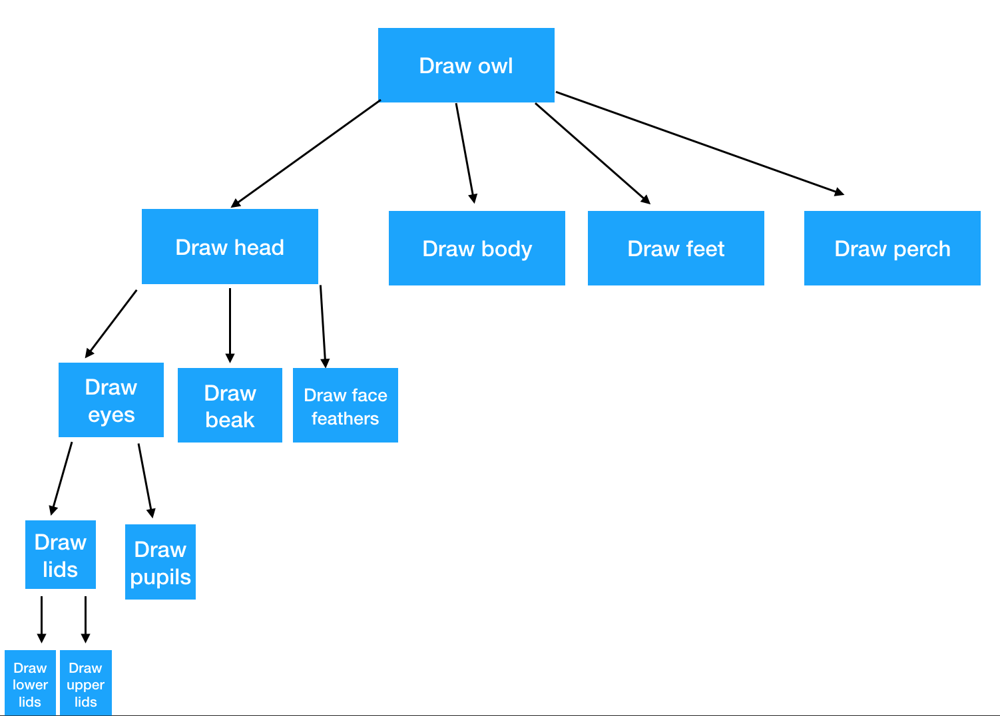

<div class="goals-agenda">
  <div>
    <h3>Goals</h3>
    <strong>By the end of this session, you will be able to:</strong>
    <ul>
      <li>identify expectations of Mod 0 Capstone</li>
      <li>define top-down design and object oriented programming</li>
      <li>break down tasks using top-down design strategies</li>
      <li>model objects by breaking down their attributes and methods</li>
    </ul>
  </div>
  <div>
    <h3>Agenda</h3>
    <ul>
      <li><strong>10 min: </strong>Housekeeping and Goals</li>
      <li><strong>5 min: </strong><a href="#capstone">Capstone Preview</a></li>
      <li><strong>35 min: </strong><a href="#topdowndesign">Top Down Design</a></li>
      <li><strong>5 min: </strong>Break</li>
      <li><strong>45 min: </strong><a href="#oop">Object Oriented Programming</a></li>
      <li><strong>10 min: </strong><a href="#assessmentprev">Assessment Instructions</a></li>
    </ul>
  </div>
  <div>
    <h3>Materials</h3>
    <ul>
      <li>Notebook</li>
      <li>Writing instrument</li>
      <li>Laptop</li>
      <li>Headphones & mic</li>
    </ul>
  </div>
</div>

## Housekeeping and Goals
### Wins

- Nice work figuring out pull requests!
- All git and GitHub-related statements on the survey averaged 4 or higher

### Follow-Ups

- Markdown average score: 3.8
- Combination of "just right" and "too fast" for session pace
- Don't "Initial Commit" on an already-existing project (like the mod0resources repository)
- Easy to get lost / sometimes the best way to learn is by making mistakes
- Edit files using your text editor, not `echo`

### Other Notes

- Initial commit ONLY for repo starting point (see commits from [mod0references](https://github.com/turingschool-examples/mod0resources/commits/master) repo as an example)
- Good commit message format: 

```
Add list of mod 0 resources
Remove reference to old blog post
Change data type of age field
Fix spelling mistake
```

- Not good commit message format: 

```
Rachel is adding her list of mod 0 resources
old blog post
changed data type for age field
Oops, I need to fix my spelling mistake
```

- Instead of simply trying to absorb information, practice and apply
- Today's Goals

## Capstone Preview

We'll break into FE and BE groups to talk briefly about the Mod 0 Capstone and how to submit it (5 min). 

## Intros, Review, and Icebreaker

<div class="try-it">
  <h3>Intros, Review, and Icebreaker</h3>
  <p>Person with the shortest first name goes first.</p>
  <p>1. Introduce yourself: name, pronouns</p>
  <p>2. What's something you're really good at? (Don't be humble!)</p>
  <p>3. Accountability review: what tangible progress have you made toward the focus skills you identified at the beginning of Mod 0?</p>
  <p>Have extra time? Share what extra things you're doing to get ready to start school at Turing.</p>
</div>

<a name="topdowndesign"></a>
## Top Down Design

> "Programing is hard because it requires us to solve ill-defined problems with unknown solutions. Our job is to invent the solutions. Coding is inherently creative." - [Danny Smith on Breaking Down Problems](https://medium.com/@dannysmith/breaking-down-problems-its-hard-when-you-re-learning-to-code-f10269f4ccd5)

<span class="vocab">Top Down Design</span> (or step-wise design) is an approach to breaking down a problem or system. In this approach, the designer lays out the problem or system's high-level overview, then breaking down the overview into sub-systems (or sub-steps), then repeating that process until the system has been broken down into the smallest pieces. 

#### This is not top-down design:


<p><em><small>Credit: https://eurokeks.com/</small></em></p>

#### This is the start of a top-down approach:



**Why is this important?** A problem that is not broken down into its smallest components remains too complex and abstract to code. In addition, small components allow for reusable and replaceable units of code. 

As humans, we memorize and practice the steps that it takes in order to do even the most basic tasks. If you tell a human to tie their shoe, you (generally) don't need to specify any further instructions. However, if you were to build a shoe-tying machine, you would need to break down the process into the most basic steps. 

<div class="try-it">
  <h3>Try It Together: Doing Laundry</h3> 
  <p>Follow along with your paper and pencil as we walk through breaking down the process of doing laundry.</p>
</div>

Now, in groups! 

<div class="try-it">
  <h3>Try It (Break Out Rooms): Top Down Design</h3> 
  <p>The person whose first name starts closest to the letter F will pick a scenario below:</p>
  <ul>
    <li>Reheating a meal</li>
    <li>Mailing a package</li>
    <li>Walking a dog</li>
    <li>Putting children to bed</li>
    <li>Applying for a job</li>
    <li>Writing an essay</li>
    <li>Starting a campfire</li>
    <li>[Choose your own adventure]</li>
  </ul>
  <p>As a group, use a Top-Down Design approach to break down the scenario. Everyone should have their own diagram to share when we pair up afterward.</p>
  <p>Done? Review, revise, and choose another scenario.</p>
  <p>Be ready to share and explain.</p>
</div>

##### Feedback

* Are there any sub-steps that look out of place? 
* Suggest one way that your partner could break down a step further.


### Top Down Design in Programming


<p><small>Credit: Liam McQuay (IGCSE Computer Science Youtube Tutorial)</small></p>

Breaking down problems using top down design lends itself nicely to the object-oriented design principles of <span class="vocab">abstraction</span> (where an object performs a task without other objects being concerned about how it is done) and <span class="vocab">encapsulation</span> (where an object handles its own internal states and behind-the-scenes work). 

### Notating Top-Down Design for the Mod 0 Assessment

On your Mod 0 Assessment, you will be asked to break down a scenario using Top Down Design. We'll demonstrate the laundry scenario in a Github Gist and give you a chance to practice with the scenario from your breakout room. 

<hr>
## BREAK

Turn off your mics and videos and walk away from the computer. Stand up, stretch, drink water. Do a few sit-ups, squats, push-ups, jumping jacks, arm circles, stress ball squeezes, or whatever else moves your body. 
<hr>

<a href="" name="oop"></a>
## Object Oriented Programming

<span class="vocab">Object oriented programming</span>, or OOP for short, is an approach to programming (or a [programmming paradigm](https://en.wikipedia.org/wiki/Comparison_of_programming_paradigms)) where programs are organized as a series of objects. 

OOP is very similar to how the world actually works. Objects are created from templates that we call <span class="vocab">classes</span>. 

A class defines attributes (or properties) and methods (or actions). 

<span class="vocab">Attributes</span> contain **data** about a specific object. The information format should be one of the basic data types from Session 2 (string, integer, float, boolean, array, hash). 

The names of attributes are generally nouns. 

Two good questions to ask when you're determining what should be classified as an attribute are: 

* "Is this piece of data something that could potentially stay the same over the course of an object's lifetime?" (you want the answer to be yes)
* "Is there any other data that underlies this piece of data?" (you want the answer to be no)

CAUTION: Sometimes, methods will *feel* like they should be attributes. For example: `age`, `years_employed`, `percent_full`. 

<div class="try-it">
  <h3>Try It Together: Bottle Class Attributes</h3> 
  <p>Follow along with your paper and pencil as we walk through defining a bottle class with three different bottle objects.</p>
  <b>NOTE</b>: For consistency in this lesson, we're going to stick to the naming convention of <code>snake_case</code>. This will look very Ruby-esque. However, in JavaScript land, you'll see <code>camelCase</code>. 
</div>

<span class="vocab">Methods</span> define **behavior** of an object, **actions** that can be performed on that object, or **calculations** that generally use . Methods are generally verbs (action words or short action phrases). 

Methods generally answer the question "What can this thing do?" or "What can be done to this thing?"

<div class="try-it">
  <h3>Try It Together: Bottle Class Methods</h3> 
  <p>Follow along with your paper and pencil as we walk through defining a bottle class with three different bottle objects.</p>
</div>

#### Key Points

* A method performs some kind of work and will almost always **use** or **modify** an attribute
* Anything that does work (calculations) should be a method, not an attribute
* Attributes are generally nouns (99.9% of time)
* Methods are generally verbs (90% of time -- can also be questions OR nouns that are the result of calculations)
* One quick side note: accessor methods are outside the scope of today's lesson. 

### Can You Spot the Problem? 

What would be wrong with...

* a class called `Turing` 
* an attribute called `current_time`
* having attributes for a `Review` class called `one_star`, `two_stars`, `three_stars`, etc.
* a class called `TacoBell`
* having attributes on a `ShoppingCart` class called `item_one`, `item_two`, `item_three`, etc.
* a method on `GroceryStore` called `clean_aisle_seven`
* a `Bottle` class having an attribute called `water`

<div class="try-it">
  <h3>Try It (Big Breakout Rooms)</h3> 
  <p>Make a copy of <a href="https://docs.google.com/document/d/17NykxDAM3OrlAm4xwYLY7uh_YokLyPgP0ahmkJ1Rd5s/edit?usp=sharing" title="">this document</a> which your group will use to practice.</p>
  <p>Person whose first name starts closest to Q will share their screen and choose one of the following classes:</p>
  <ul>
    <li>Vehicle</li>
    <li>Book</li>
    <li>Playlist</li>
    <li>GroceryStore</li>
  </ul>
  <p>As a team, brainstorm the attributes (and data types), methods (and descriptions) for your chosen class. Each person should be keeping their own copy up to date to use as a reference.</p>
  <p>Person whose first name starts closest to the letter A will suggest an object that is an instance of the class. This is Object #1.</p>
  <p>Brainstorm the values for each attribute of that object.</p>
  <p>Brainstorm the results of each method called on that object.</p>
  <p>Person whose first name starts closest to the letter E will suggest a second object that is an instance of the class. This is Object #2.</p>
  <p>Repeat the brainstorm process for attributes and methods for object #2. </p>
</div>

##### Feedback

* Are all of the attributes nouns? Do they all represent a property or characteristic?
* 
* Suggest one way that your partner could break down a step further.

### Notating Classes, Objects, Attributes, and Methods for the Mod 0 Assessment

On your Mod 0 Assessment, you will be asked to identify classes, objects, attributes, and methods. We'll demonstrate the format we want you to use, then we'll give you some time to try it out with the class from your breakout room. 

<a name="assessmentprev"></a>
## Mod 0 Technical Assessment

This is our final Mod 0 technical session. Your assignment between now and Thursday is to find 80 minutes  to complete the [Mod 0 Technical Assessment](https://fierce-beyond-34376.herokuapp.com). 

<div class="instructions assessmentpreview">
  <h1>SAMPLE INSTRUCTIONS</h1>

  <p>This work portion assessment should take you approximately 70 minutes, but we recommend taking an additional 10 minutes to throughly read over the expectations outlined in this document. The timed nature is meant to get you used to working under pressure.</p>

  <p class="important"><strong>First,</strong> fork the assessment checklist. You will use this checklist to ensure that you have met the Mod 0 Technical Assessment expectations.</p>

  <h4>Part I: Creating Directories and Files; Initializing Git and Pushing to GitHub (10 min)</h4>

  <ol>
    <li>Use your terminal to create a directory called <code>...</code></li>
    <li>Inside of that directory, make an empty text file called <code>...</code></li>
    <li>Initialize your directory as a git repository.</li>
    <li>Add your file and commit using the message "Initial commit"</li>
    <li>Create a public repo on Github with the same name.</li>
    <li>Add the remote and push your local repository to Github.</li>
  </ol>

  <h4>Part II: Top Down Design (25 min)</h4>

  <ol>
    <li>Open up your <code>...</code> file in your text editor.</li>
    <li>Break down the process of <code>...</code> <small>(We will leave the situation intentionally vague so that you can choose what angle you feel most comfortable with. Although we are not looking for a specific "answer" for how you break this down, you should be as detailed as possible. It is better to break things down too much than to oversimplify a process. Use the same process and notation that we used during Session 5 with a dash mark and one indent for every new layer.)</small></li>
    <li>Save your file.</li>
    <li>Add and commit your changes.</li>
    <li>Push your changes to Github.</li>
  </ol>

  <h4>Part III: Classes, Objects, Attributes, and Methods (35 min)</h4>

  <ol>
    <li>Inside of <code>...</code>, create a new directory called <code>...</code></li>
    <li>Inside of <code>...</code>, create four files: <code>...</code>, <code>...</code>, <code>...</code>, and <code>...</code><em>(If you're comfortable trying markdown at this point, feel free to use .md instead of .txt).</em> </li>
    <li>Open up <code>...</code> in your text editor.</li>
    <li>Brainstorm one class that might exist in a <code>...</code> and put this at the top of the file.</li>
    <li>List at least three attributes for that class. In parentheses, list the data type for that attribute (string, boolean, integer, float, hash/object, datetime).</li>
    <li>List at least three methods for that class. In parentheses, explain what the method does, including the names of the attributes that it uses or modifies.</li>
    <li>Save your file.</li>
    <li>Add and commit your changes for this class.</li>
    <li>Open up <code>...</code> in your text editor.</li>
    <li>At the top, type the name of an object that is an instance of your class.</li>
    <li>List the values for each attribute.</li>
    <li>List the results of the method being called for this specific object.</li>
    <li>Save your file.</li>
    <li>Add and commit your changes for this class.</li>
    <li>Repeat steps 3-8 with <code>...</code></li>
    <li>Repeat steps 9-14 with <code>...</code></li>
    <li>Push your changes to GitHub.</li>
  </ol>

  <h4 class="important">Done?</h4>
  <p>Check off all of the items on your forked checklist, then send the checklist to Tim and Rachel in a DM on Slack.</p>
</div>
