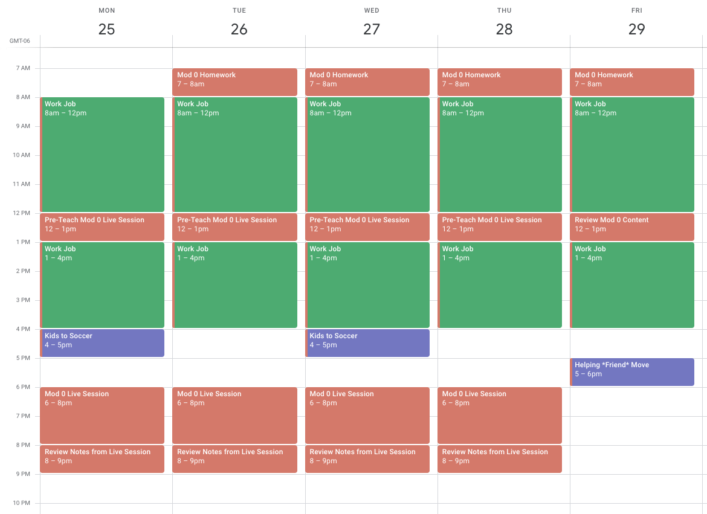

  <h3>Prepare to Engage</h3>
  
Whether you are starting your day with this activity or wrapping up a long day of technical work with this, take a moment to ground yourself in why you became a student at Turing. This Career Development work is arguably the most valuable component of your education that will lead you into your new career.

  
Take a moment to reset if needed, meditate, or do some physical stretches/movement to get yourself into the space you need to be in to engage in this work. Some optional guiding questions follow.

  <ul>
    <li>Why did you come to Turing?</li>
    <li>What is the thing that will motivate you to keep going on the days/weeks you feel <em>most</em> challenged at Turing?</li>
  </ul>

 

## Learning Goals

- Implement a calendar system
- Plan a routine to increase time awareness

## Time Management at Turing

Turing is a full-time, immersive program. You are going to learn the technical and professional skills needed to succeed in demanding, yet high-paying technical careers in less than a year.

Most students estimate they work an **average of 65-75 hours per week** at Turing; some weeks with fewer hours, some weeks with more hours. While at Turing, **time** is your most valuable commodity. How you use your time will be a determining factor in your overall success in the program.

  <h3>65-75 hours per week</h3>
  
In whatever way makes most sense to you, visualize what 65-75 hours per week would look like on a daily basis.

  
Think about the details of that "daily" life. If you said you'd work ~10 hours/day - what do you do with your other 14? How do you plan in time to eat? How many hours are allotted to sleep? When do you grocery shop? Spend time with family? Walk the dogs? And whatever else is important or essential to you?

  
Jot down notes about this if you'd like; you don't need to submit anything for this specific prompt, but it should help you get in the right frame of mind for the rest of this activity.

 

### Calendaring

One strategy we’ve seen our most successful students employ is using some type of calendar system to track, manage and plan their time while in the program. A few key notes:

- Calendaring is a very difficult skill to master - you will need to commit to practicing it in order to improve.
- Find a calendar tool and stick with it. Everyone’s system, calendar tool, etc. might be a little different, but those who don't use any tool typically struggle with time management while at Turing. We **strongly recommend** you use Google Calendar for two reasons: it's what we use at Turing and it is a very popular tool in the industry, so it is good to practice using it now.
- Calendars are meant to be **living documents** that can change. You can’t plan for everything, and sometimes we don’t accurately estimate how long something will take. Being able to make adjustments to calendars as things change is a very important skill to start practicing. This is another reason a digital tool like Google Calendar is helpful - it's super easy to adjust things as needed.

### Time Management and Calendar Tips from Successful Students

- **Purposefully build in scheduled time for health, wellness and whatever else you need to be your best self.** If you don’t plan for it, chances are it won’t happen. Turing moves fast, but it is still a marathon. How can you make sure you are creating a sustainable schedule/routine?
- **Break down time blocks as much as possible.** Anything over an hour will usually be unproductive and give too much time to procrastinate. Additionally, on each calendar event, name the specific task you expect you to complete in that time. If you don't finish or something else takes longer, you just move that block instead of losing your tasks. It’s like a task list and a calendar in one!
- **Avoid context-shifting too frequently.** On the flip side, don’t break down your blocks too much. For example, trying to cram 4-5 different tasks into a single hour is also not productive and can be extremely exhausting.
- **When you think of something you need to do, put it on your calendar immediately.** For example, if after a lesson, you think to yourself “I really want to go back and finish that activity we started in the lesson…” you should immediately pull up your calendar, find a 15-30 minute block of time in the next couple of days and make an event for working on that particular exercise (and add the link to the lesson and/or exercise to that event).
- **Reflect on your time management each week.** Build in time each week to reflect on how well you stuck to your schedule. Be gracious to yourself and make a plan for the upcoming week.
- **Time management becomes more important throughout the program.** As the program progresses, you will find yourself balancing more responsibilities. For example, in Mod 4, you'll continue learning some technical content while simultaneously searching for your first software developer job.

## Mod 0

Mod 0 is short and fast! That may lead us to believe we don't have much time to manage, so we shouldn't worry about it. But, every minute matters, even more so when it is so fast-paced.

  <h3>Mod 0 Calendar</h3>
  <ul>
    <li>Consider what you are currently using for a calendaring tool. If you don't have anything, Google Calendar is a great place to start.</li>
    <li>Using the Mod 0 Site as a guide, create calendar events for the rest of the work left in Mod 0 to map out how your time might be used the rest of this week. We know you don't know how long something will take so just start with 1-2 hours for each assignment and you can always adjust. Remember, your calendar is a living document.</li>
    <li>Add in any personal responsibilities you need to fulfill.</li>
    <li>Add in a reminder to reflect and adjust your calendar (to document what happened in the <em>past</em>) - probably at the end of each day. This will help you increase your awareness of where you spend your time. You may also use this time to look ahead to the upcoming day and make any adjustments.</li>
  </ul>

Here is an example of what your calendar might look like if you are a student in Mod 0. Notice that there is still some empty space on the calendar. That's important too! We still need some breathing room, so that we can adjust along the way.

## Mod 1

In Mod 1, you'll be expected to be available and fully engaged between the hours of 9am-12pm and 1pm-4pm MT, Monday-Friday (excluding any holidays Turing observes). During those times, you'll be in live, whole-group classes, possibly in small-group sessions led by instructors, and some of that time will be structured work time with teammates, check-ins or evaluations with instructors.

In addition to those specific hours, most students spend 35-40 hours outside of formal class time to work on the project that is currently assigned, and study/practice on their own. About half of the projects assigned are collaborative; meaning you will not be working independently (with only _your_ brain and _your_ schedule), but will need to find times to meet with your teammates. Sometimes, this will mean compromising. However, it's important to have some clear boundaries for your self-care.

When it comes to the way they spend their time, there are two major pitfalls we see students fall into, that result in them burning out and usually repeating Mod 1:
1. Not dedicating any time to their personal needs: scheduling seven 14-hour days of coding a week.
1. Underestimating the Turing commitment and then being disappointed when they don't have time to do things they enjoy (play guitar for 3 hours a day, work a part-time job, go to Happy Hour several evenings a week, or go skiing every weekend).

Since each Mod is only 6 weeks long, if you fall behind by one week, it can be really hard to catch up. Having a proactive and realistic plan is the best way to set yourself up for success.

The <a href="https://frontend.turing.edu/today/" target="_blank">Front End</a> and <a href="https://backend.turing.edu/additional_resources/calendars" target="_blank">Back End</a> calendars are available for you to add to your calendar or bookmarks. These calendars won't _yet_ have detailed agendas for your first few weeks, but you can revisit the first few weeks of the previous inning (either 7 or 8 weeks before your start date) to understand what your first few weeks will look like. The calendar is subject to change slightly, but this will give you an idea of what the day-to-day experience will be like.

  <h3>Mod 1 Calendar</h3>
  
Similar to what you did for Mod 0, create a calendar for your first 2 weeks of Mod 1. Keep in mind that these weeks won't be quite as detailed as your Mod 0 calendar, because you don't know as much about the details of each task. As you begin the program, you'll likely add in specific tasks, but for now, you want a general idea of what to expect. Consider your personal needs, relationships, and hours you work best. Your calendar should include the following:

  <ul>
    <li>Live class times blocked off (9-12 and 1-4)</li>
    <li>Study/Project work time (usually about 25 hours/week outside of class time)</li>
    <li>Time to reflect on the day/week, prep for the upcoming day/week, adjust calendar, etc.</li>
    <li>Personal, Health + Wellness</li>
  </ul>

## Check For Understanding

Please create a section in your Mod 0 Gist for **Calendaring** and record your answers to these questions. 

The following questions apply to your time as a Turing student once you start Mod 1.

1. What times will you dedicate to pre-teaching the upcoming lesson?
1. What times will you dedicate to reviewing lessons?
1. What time will you dedicate to project work time? (Sometimes you will have time during class hours to work on projects.)
1. What time are you carving out for your own mental and emotional health needs? 
1. How will you spend your weekends?

     
